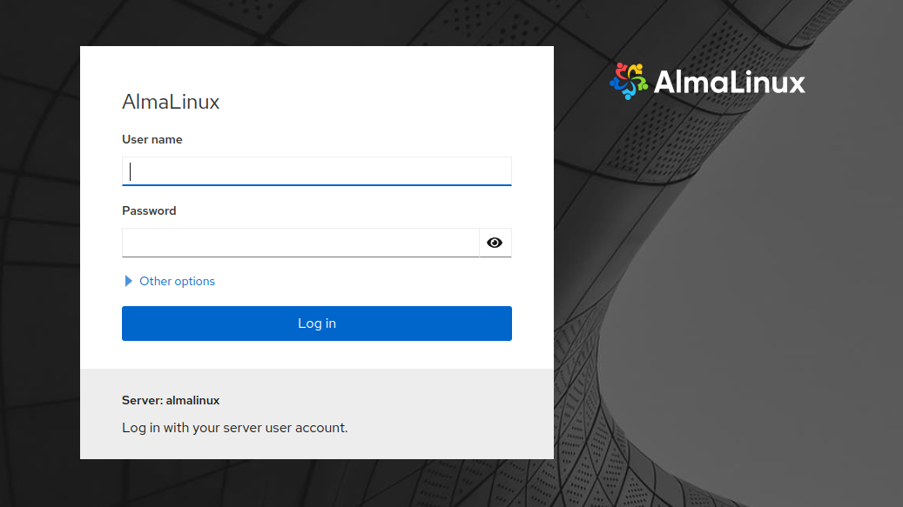

+++
title = "Alma Linux and Cockpit: A Perfect Match"
date = "2023-01-04T20:59:12-06:00"
author = ""
authorTwitter = "" #do not include @
cover = "images/cockpit.png"
tags = ["AlmaLinux", "Cockpit"]
keywords = ["Alma", "Linux", "Cockpit"]
description = "Cockpit is a free, open-source web-based server manager that allows easy management of server through your web browser. In this article I detail the quick process of installing Cockpit as a plugin for AlmaLinux, a community-driven, free enterprise-grade distro of RHEL."
showFullContent = false
readingTime = true
hideComments = false
color = "" #color from the theme settings
+++



## [AlmaLinux](https://almalinux.org/)
### A Community-driven, free enterprise-grade distribution of Red Hat Enterprise Linux, or RHEL for short.

## [Cockpit](https://cockpit-project.org/)
### A free, open-source web-based server manager that allows you to easily manage your server through a web browser.

## Installing AlmaLinux  
### You can [download](https://mirrors.almalinux.org/isos.html) and install AlmaLinux using a VM like [VirtualBox](https://www.virtualbox.org/) or [QEMU](https://www.qemu.org/), but I recommend an old Intel machine or a server unit.
#### For USB I'd recommend a Windows tool called [YUMI/Ventoy(ExFat)](https://www.pendrivelinux.com/yumi-multiboot-usb-creator/#YUMI-exFAT)
#### My go-to for Linux is old school [DD](https://www.geeksforgeeks.org/dd-command-linux/) (do be careful with that one if you're unfamiliar with DD maybe avoid it)

## Installing Cockpit on AlmaLinux
### To Install Cockpit on AlmaLinux requires the [Extra Packages for Enterprise Linux (EPEL) repository]() to be enabled. To do so, run the following commands:  
```
sudo dnf update
sudo dnf install epel-release
sudo dnf update
sudo dnf install cockpit
```

### To start the cockpit service simply run the following `systemctl` command:  
```
sudo systemctl enable --now cockpit.socket
```

### From Cockpit you can now easily manage everything from your [firewall rules](https://firewalld.org/) to your [podman](https://podman.io/) containers and more!
