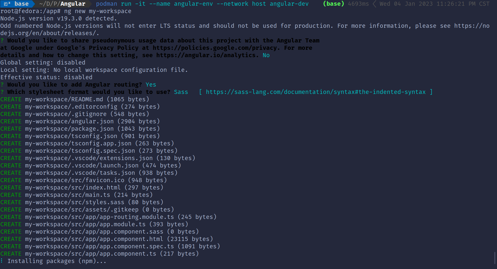

+++
title = "Angular CLI Up And Running with Docker and Podman"
date = "2023-01-04T23:04:46-06:00"
author = ""
authorTwitter = "" #do not include @
cover = "images/angular2-podman.png"
tags = ["Angular-2", "Podman", "Docker"]
keywords = ["Angular-2", "Podman", "Docker"]
description = "Quickly initialize Angular CLI with Podman or Docker"
showFullContent = false
readingTime = true
hideComments = false
color = "" #color from the theme settings
+++

### [Podman](https://podman.io/) is a tool for managing and running [containerized applications](https://www.ibm.com/topics/containerization) on [Linux](https://en.wikipedia.org/wiki/Linux) and uses a command-line interface to create and manage containers directly, without the need for a [daemon process](https://en.wikipedia.org/wiki/Daemon_(computing)). It can access various container registries, including [Docker Hub](https://hub.docker.com/), to store and distribute images used to create containers.
### [Docker](https://www.docker.com/) is a similar tool with its own registry, but it requires a [daemon](https://docs.docker.com/engine/reference/commandline/dockerd/) to run in order to work, but also runs on [windows](https://docs.docker.com/desktop/install/windows-install/). [Docker Desktop](https://www.docker.com/products/docker-desktop/) is a desktop application that provides an easy-to-use development environment for building, testing, and deploying Docker applications. It includes tools such as the Docker Engine, Docker Compose, and Docker Machine, as well as a Kubernetes server and support for other orchestration platforms. Docker Desktop makes it easy for developers to get started with Docker and streamlines the development workflow by providing a single, integrated environment for building, testing, and deploying applications. In this quick demo we we wil not get into the depths of Docker, but **Dockerfiles are fully compatible with Podman**, so you can use a Dockerfile to build an image with Podman just as you would with Docker.
### A [Dockerfile](https://docs.docker.com/engine/reference/builder/) specifies the base image to use for the build, as well as any additional dependencies and instructions needed to build the image. With a few commands it's possible to get anything up and running, but for this demo we'll stick to a simple [Angular CLI](https://angular.io/cli) example.

> ## Install [Docker](https://www.docker.com/) or [Podman](https://podman.io/)

> ## [VS Code](https://code.visualstudio.com/) has a few [Docker extensions](https://marketplace.visualstudio.com/search?term=docker&target=VSCode&category=All%20categories&sortBy=Relevance) that may help

> ## Create a new text file name `Dockerfile` without a file extension, and paste the following snippet in:  
```
# Dockerfile
FROM node:latest

# Install Angular CLI
RUN npm install -g @angular/cli

# Set the working directory
WORKDIR /app

# Set the entrypoint to a shell
ENTRYPOINT ["/bin/bash"]
```
* `FROM`: Specifies the base image to use for the build. In this case, the base image is `node:latest`, which is the latest version of the Node.js image from the Docker Hub registry
* `RUN`: Runs a command during the image build process. `npm install -g @angular/cli` installs the Angular CLI tool globally
* `WORKDIR`: Sets the working directory for the subsequent instructions in the `Dockerfile`. The working directory is set to `/app`
* `ENTRYPOINT`: Specifies the command that will be run when a container is started from the image. The entrypoint is set to `/bin/bash`, which means that the container will run a [bash shell](https://www.gnu.org/software/bash/) when it is started

> ## Build the `Dockerfile` use one of the following commands:  
```
podman build -t angular-dev .

or

docker build -t angular-dev .
```
* `podman`: and `docker` are interchangeable
* `build`: is the command to build the `Dockerfile` into a `Docker Image`
* `-t`: used to specify the name and optionally a tag to the name of the image in the name:tag format
* `angular-dev`: the name of our `image`
* `.`: the location of our `Dockerfile`  

> ## Finally to run the image in a container use one of these commands:  
```
podman run -it --name angular-env --network host angular-dev

or

docker run -it --name angular-env --network host angular-dev
```

* `-i`: stands for "interactive" and keeps STDIN open even if not attached. This allows you to run the container interactively, so you can input commands and see the output in the terminal.
* `-t`: stands for "tty" and allocates a pseudo-tty. This allows you to interact with the container as if it were a terminal, even if you are not running it interactively.
* `--name`: specifies a name for the container. In this case, the name is "angular-env".
* `--network host`: tells Podman to use the host's network stack for the container. This means that the container will have the same network connectivity as the host and will be able to access the host's network resources.
* `angular-dev`: This is the name of the image to use to create the container. In this case, the image is called "angular-dev".

> ## A successful launch will look something like this in your terminal:
```
root@hostname:/app#
```



> ## Finally once the Image has been built, and the container has been launched, you can input the following commands into the prompt:
```
# create a new Angular workspace
ng new my-workspace

# change into the workspace directory
cd my-workspace

# generate a new Angular application
ng generate application my-project

# change into the project directory
cd projects/my-project/

# build the sample application
ng build

# and serve to localhost:4200 by default
ng serve
```

### There's a lot more you can do once you get to this point, such as going on to link a Database and building out a portable Angular dev environment, but the main point of this article was to introduce Podman as a Development tool. I plan on continuing on with podman to build environments for other programming languages in the future.