+++
title = "Building Games With Godot 4 and Other Free Software"
date = "2023-01-08T05:40:47-06:00"
author = ""
authorTwitter = "" #do not include @
cover = "images/thumb.png"
tags = ["Godot", "Blender", "Krita", "Laigter", "OBS", "Lossless-Cut", "Openshot", "GIMP"]
keywords = ["Godot", "Blender", "Krita", "Laigter", "OBS", "Lossless-Cut", "Openshot", "GIMP"]
description = "Using several open source tools for game development, video editing, and image manipulation to bring a small demo to life. These tools include Godot 4, Blender, Krita, Laigter, OBS, Lossless-Cut, and GIMP. We will provide an overview of each tool's features and give tips on how to use them effectively. Whether you are a beginner or experienced creator, these tools offer a range of functionality to bring your ideas to life."
showFullContent = false
readingTime = true
hideComments = false
color = "" #color from the theme settings
+++

## [Godot 4 Beta 10](https://godotengine.org/en/article/dev-snapshot-godot-4-0-beta-10)
>Godot is an open source game engine that allows you to create 2D and 3D games. It has a user-friendly interface and a visual scripting system that makes it easy for beginners to get started.

## [Blender](https://www.blender.org/)
>Blender is a powerful open source software for 3D modeling, animation, and rendering. It has a wide range of features and a comprehensive set of tools for creating detailed 3D models and realistic animations.

## [Krita](https://krita.org/)
>Krita is an open source digital painting and illustration software. It is well-suited for creating concept art, comics, and other 2D art. It has a wide range of brush options and a user-friendly interface.

## [Laigter](https://azagaya.itch.io/laigter)
>Laigter is a free and open source 3D rendering tool that is designed to be easy to use and provide high-quality results. It is a good choice for beginners looking to create 3D models and animations.

## [OBS](https://obsproject.com/)
>OBS, or Open Broadcaster Software, is a free and open source software for recording and live streaming video. It is popular for its versatility and wide range of features, making it a good choice for beginners looking to stream their gameplay or other content.

## [LosslessCut](https://mifi.no/losslesscut/)
>Lossless-Cut is a free and open source video editor that is designed to be simple to use and provide high-quality results. It is a good choice for beginners looking to edit and trim their video footage.

## [Openshot](https://www.openshot.org/)
>Openshot is a free, open source video editor that is easy to use and packed with features. Whether you are a beginner or an experienced video editor, Openshot has something to offer. With a clean and intuitive interface, it is easy to get started with Openshot. You can import your video and audio files, trim and cut your clips, add transitions and effects, and much more. Plus, with its support for a wide range of file formats, you can work with just about any type of media. Give Openshot a try and see how it can help you bring your video projects to life.

## [GIMP](https://www.gimp.org/)
>GIMP (GNU Image Manipulation Program) is a powerful, open source image editor that is perfect for both beginners and professionals. With a wide range of tools and features, GIMP is well-equipped for tasks such as photo retouching, image composition, and image authoring. Its user-friendly interface makes it easy to get started, and its support for a wide range of file formats means you can work with just about any type of image. Whether you are looking to touch up your photos or create original artwork, GIMP has something to offer. Give it a try and see how it can help you bring your creative vision to life.

##### **The description headers are hyperlinks to each project's website*
##### **Descriptions provided by ChatGPT*

[Here's the quick video I shot for this post](https://www.youtube.com/watch?v=QqRck5c8eRs)

I've used all of these softwares to varying degrees. Some as long as 15 years (GIMP) others I came across today (Laigter). In this article I will attempt to recap what I believe are the most important parts of [DevLogLogan](https://www.youtube.com/watch?v=VjuyfBaryu8)'s tutorial video putting all of the pieces I've known together in one package. Though his video is 25 minutes, I paused and followed closely along the way, and by the end of the project I spent just under 3 hours creating and designing and putting all the pieces together for myself; an invaluable experience.

### Krita
I had never used Krita for much other than simplistic pixel art until today, and also I didn't think I'd sign up for [texutres.com](https://www.textures.com/library), but as [DevLogLogan](https://www.youtube.com/watch?v=VjuyfBaryu8&t=19s) mentions, it's free for 15 downloads every day, and I only used 2 textures. I did however realize that, after using these textures and understanding the methods used within Krita, it's quite possible I will be attempting my own seamless textures from my personal photo gallery next time which will feel even more unique. In Krita I imported the downloaded textures one at a time to work on them. Some good shortcuts to remember are:  
#### Krita Shortcuts I learned in this project
`Shift + w` - Tiles the image in all directions  
`Ctrl + Alt + c` - Resize Canvas  
`Ctrl + Alt + i` - Scale to New Size  

By using the Clone Brush Preset it's possible to touch up seam or texture region. select a clone region with `Ctrl + Left Mouse Button`, resize the regions by `Shift + Left Mouse Button + *Moving the mouse around*`, and watching the clone region while dragging the seam or texture region.

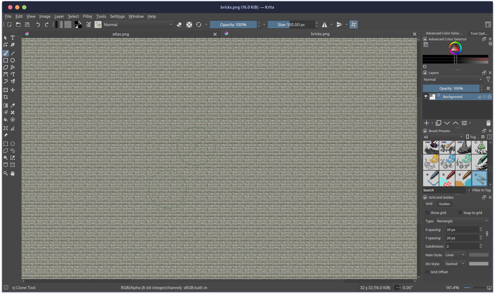

### Laigter
[DevLogLogan](https://www.youtube.com/watch?v=VjuyfBaryu8&t=435s) goes into more detail than I can about Laigter, as I have only discovered it today through his video, however I will describe its usefulness in detail. [Laigter](https://azagaya.itch.io/laigter) is all about generating texture maps. I fed it the exported brick and floor images one at a time. It lets you add a normal map of the image as it would appear in a texture atlas, and I assume it does all kinds of other equally impressive operations.

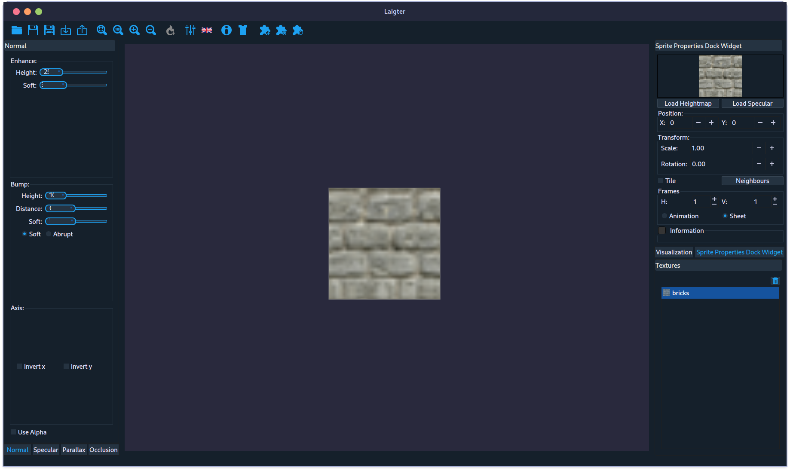

### Back to Krita, but next time I'll use GIMP for this part
The [tutorial](https://www.youtube.com/watch?v=VjuyfBaryu8&t=551s) at this point uses Krita to create a [Texture Atlas](https://en.wikipedia.org/wiki/Texture_atlas) to be used in Blender. I found Krita to be combersome for this task, and a more general purpose editor like GIMP would suit me better.

### Blender
I've used Blender for many projects throughout 2022. Before that I made around a dozen projects in Blender all together. Even with that experience I still found it to be tricky, but I was glad to have the keyboard shortcuts down. I don't think there was a shortcut I learned from the video which I've impressed myself with. I didn't realize I was getting anywhere until noticing that. I started with a blank scene, added a plane, ensured it was 1m, and from there used edge mode to extrude in 1m increments. I haven't had much experience with UV editing, but two textures is the perfect thing to get familiarized with the process. All together I made 4 dungeon structures: floor, wall, corner-in, and corner-out and fit the texture properly to the geometry like how it's shown in the [video](https://www.youtube.com/watch?v=VjuyfBaryu8&t=656s). Although building the structure in Blender required actually building some kind of *structure*, it's required to space each individual geometry out into a lineup to be properly exported. A solid tip is to name each layer "wall-**col**", "corner-**col**", etc, ... for use with Godot (it automatically provides a Trimesh Static Body) . 

> A "trimesh static body" is a type of object that you can use in a video game or other interactive application. It is made up of a bunch of little flat shapes called "triangles" that are connected together to form a 3D object. This object is called a "trimesh".

> A "static body" is an object that doesn't move around or change. It just stays in one place. So a "trimesh static body" is an object that is made up of triangles and stays in one place. It might be used to represent things like buildings, trees, or other objects that don't move in the game.

There's a ton of stuff I could go on about with this section, but what's important is that once all the geometry is lined up it needs to be exported as `*.glb` file extension from Blender to be used with Godot, as seen in the [video](https://www.youtube.com/watch?v=VjuyfBaryu8&t=1204s).

##### Static body definitions provided by ChatGPT

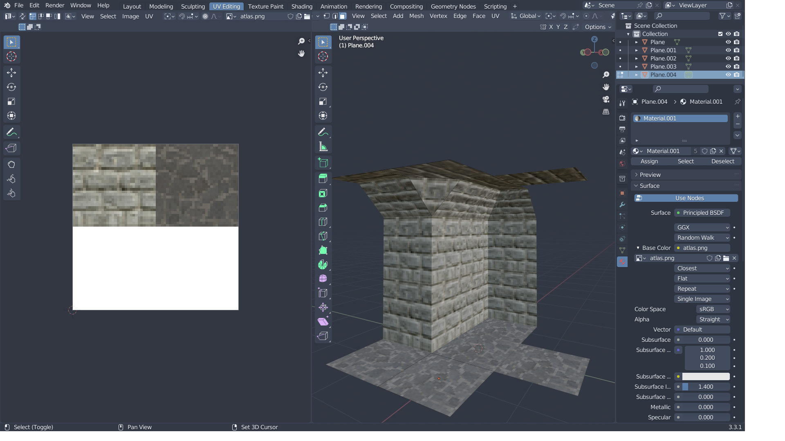

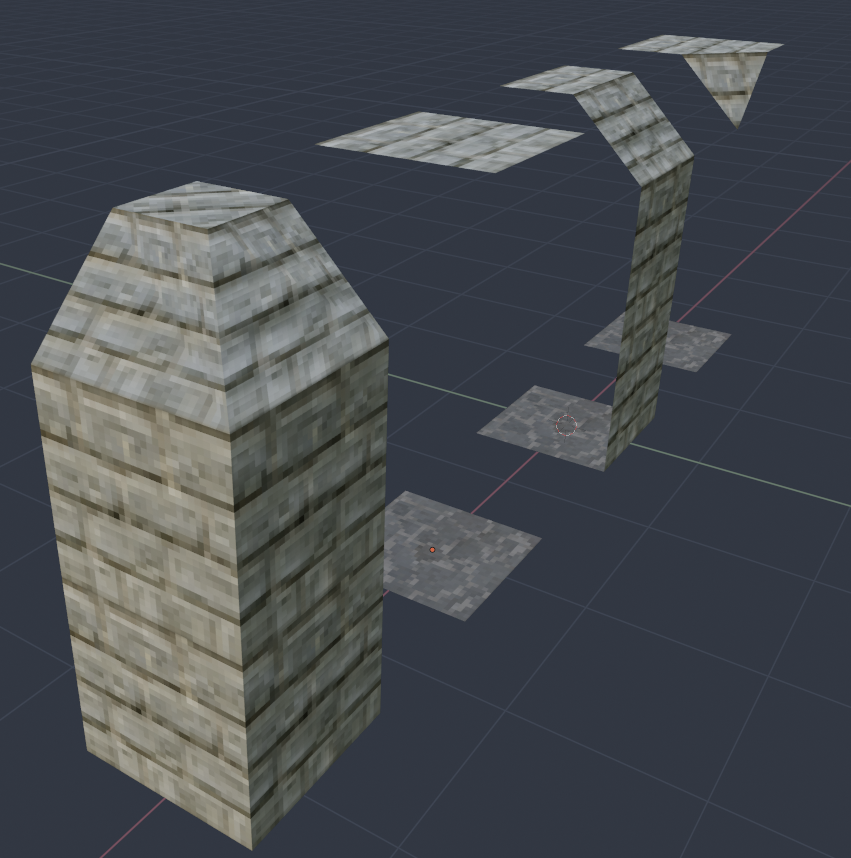

### Godot
I've done some work in Godot, but never before 2022. I really like the engine, although I have my complaints that don't belong in this article. This section of [DevLogLogan]()'s tutorial starts with a World scene with just a plane, and a Player scene (which I made [following another one of DevLogLogan's videos](https://www.youtube.com/watch?v=VjuyfBaryu8&t=1307s)). Adding the `glb` file was as easy as dragging it into the scenes list in Godot, I followed the prompts to create the resource, and added it to the Grid node to be painted onto the map after configuring the grid size to match with the geometry. **This part was fun!** Once you get to this point you're making a game! I spent probably an hour here to be honest. Adding the animations came pretty easily to me for I've used the [Animation Player](https://docs.godotengine.org/en/stable/classes/class_animationplayer.html) for every project in Godot this far. I made my weapon look more like a sword than the video did. One of the more important pieces of setup in Godot is in `Project>Project settings`. Changing the keymap to WASD and also setting up the video display correctly to stretch from 320x240 up to 720p like it is to give it that retro look.

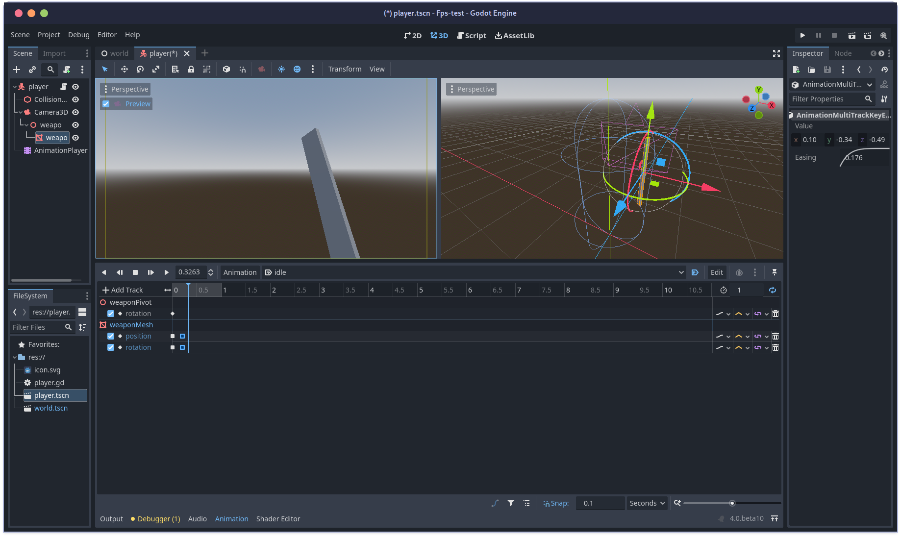

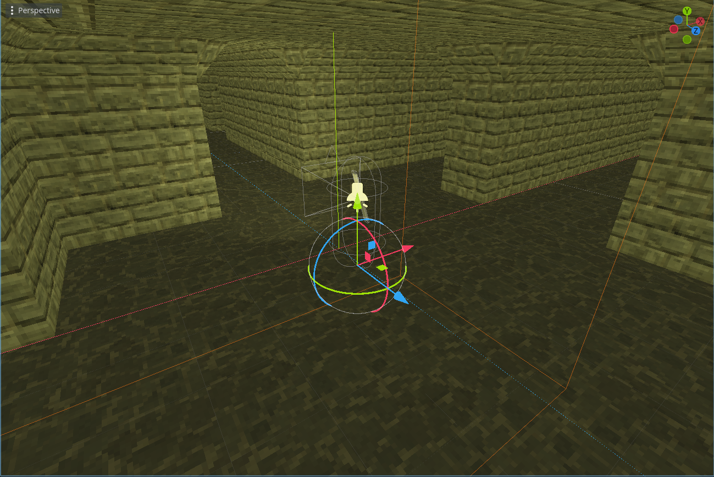

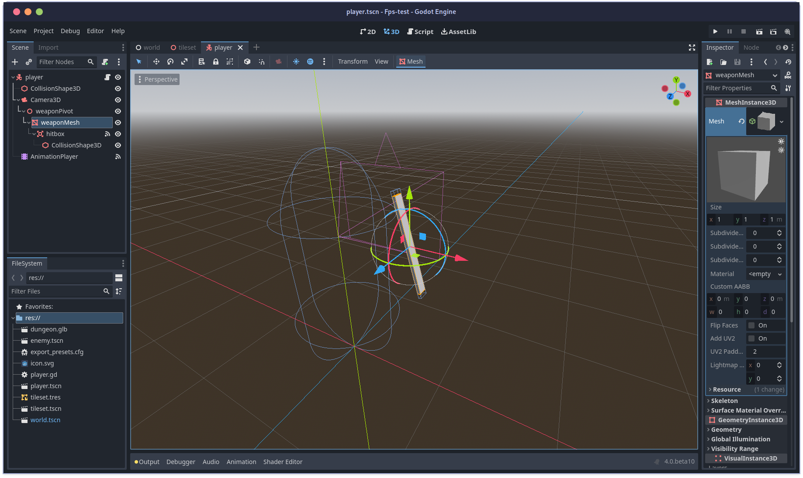

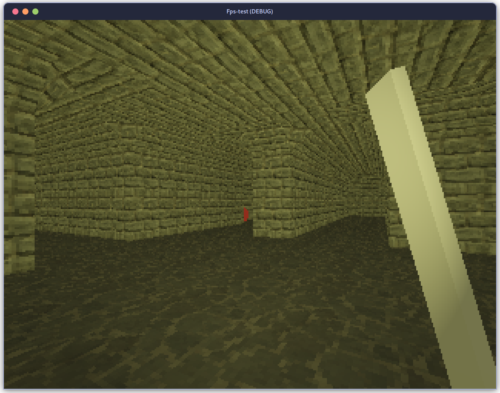

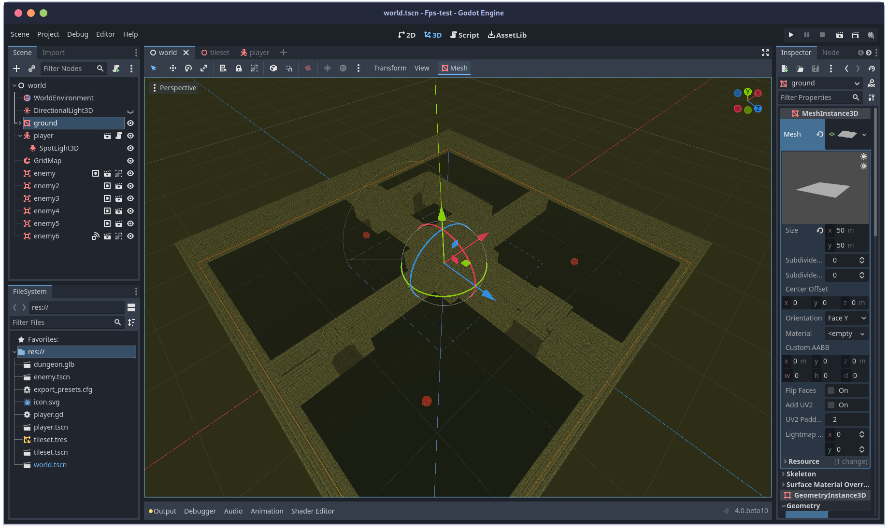

### OBS
I always take a few minutes of video to wind down a project, and OBS makes it easy to screen record just about anything. I set it and just ran around the map jumping and slashing.

### LosslessCut
I accidentally recorded trash audio from my room fan in the OBS recording, and LosslesCut makes it easy to add or remove tracks or media segments and concat a new muxed video of the original file. I chopped the OBS views from the video's beginning and ending, and removed the audio. I was also able to easily grab an image from a keyframe of the video from this tool.

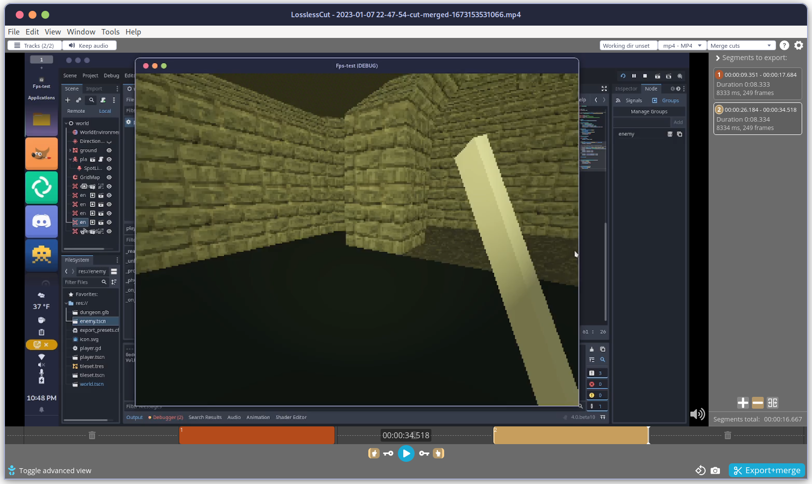

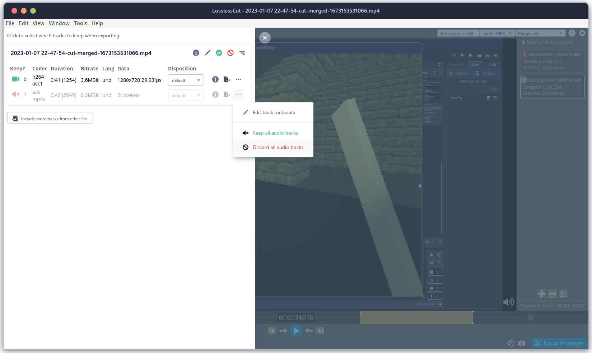

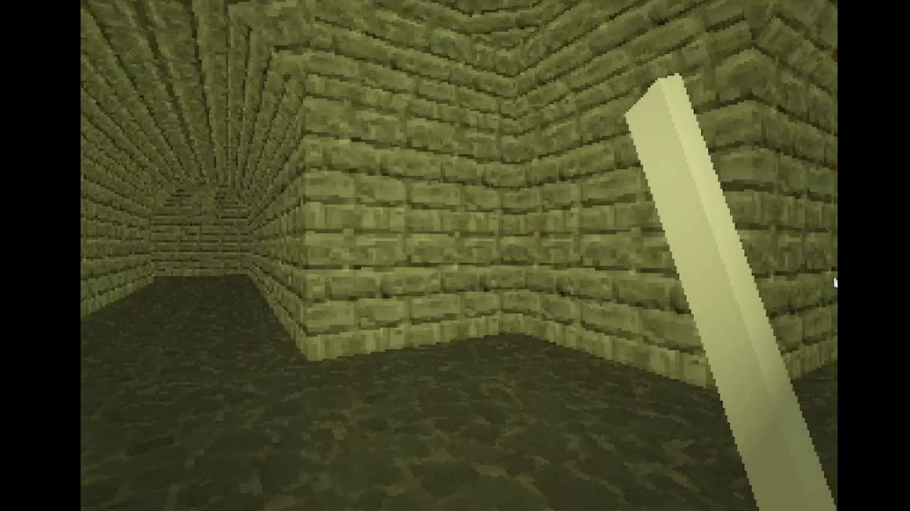

### Openshot
I did almost nothing to the file in Openshot, I would usually have added quite a bit more, but this time I ony cropped out the desktop around the video. I recommend Openshot if you don't already have a video editor. It's far from the best, but it works for almost everything if you put the time into it.

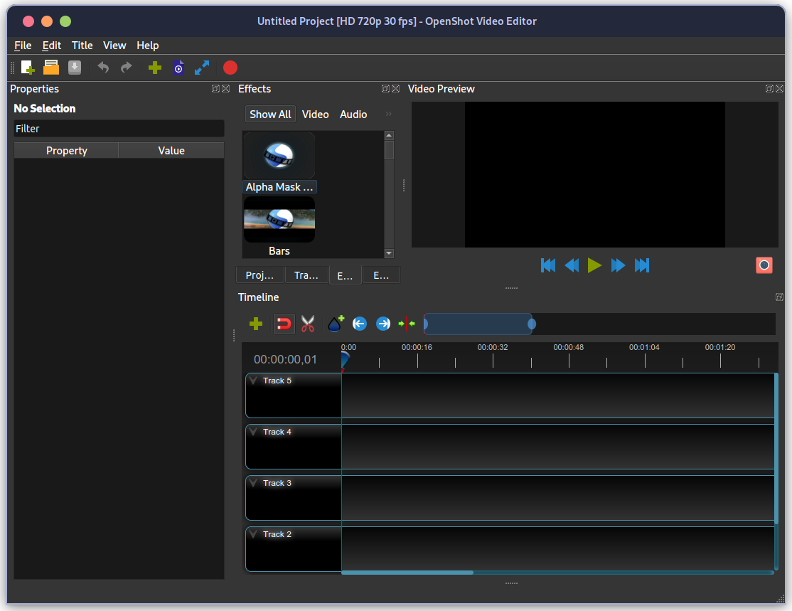

### GIMP
And finally I used GIMP to open the image captured by LosslessCut, crop down the area of the thumbnail and add the 4 logos. I already have a bunch of fonts that make this kind of work come together quickly. My go to technique is to layer everything out, add the similar ones to a group, duplicate that group and flatten it, then go on to use the *select by color* tool to select the alpha channel of the flat layer. Inverting this selection will yield a nice border to the elements on the canvas. `select>selection to path` will save this border for future layers. I use this path for two layers, the outline for text, or icons; and as well as a fill layer for the shadow backdrop which I typically offset down and right by holding `ctrl` with the move tool.

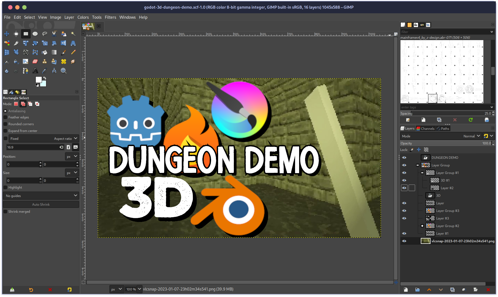

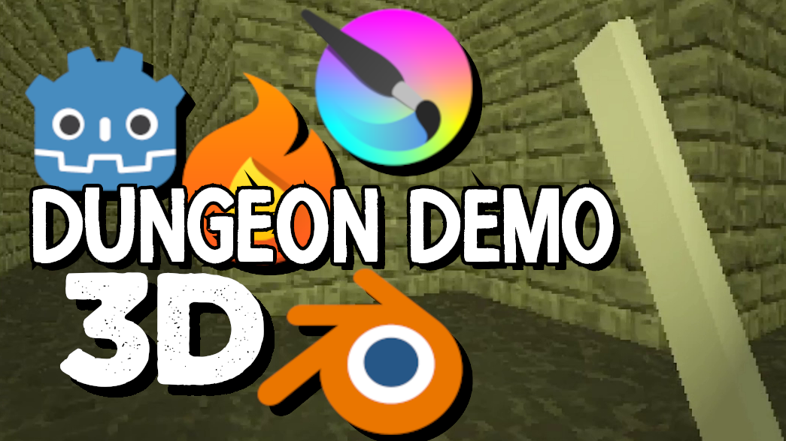

### Extra for Godot

#### The `Player.gd` script in its entirty is as follows:

```
extends CharacterBody3D

const SPEED = 5.0
const JUMP_VELOCITY = 4.5

# Get the gravity from the project settings to be synced with RigidBody nodes.
var gravity = ProjectSettings.get_setting("physics/3d/default_gravity")

@onready var camera = $Camera3D
@onready var anim_player = $AnimationPlayer
@onready var hitbox = $Camera3D/weaponPivot/weaponMesh/hitbox

func _ready():
	Input.set_mouse_mode(Input.MOUSE_MODE_CAPTURED)

func _unhandled_input(event):
	if event is InputEventMouseMotion:
		rotate_y(-event.relative.x * .005)
		camera.rotate_x(-event.relative.y * .005)
		camera.rotation.x = clamp(camera.rotation.x, -(PI/4), PI/4)

func _process(delta):
	if Input.is_action_just_pressed("quit"):
		get_tree().quit()
	if Input.is_action_just_pressed("attack"):
		anim_player.play("attack")
		hitbox.monitoring = true

func _physics_process(delta):
	# Add the gravity.
	if not is_on_floor():
		velocity.y -= gravity * delta

	# Handle Jump.
	if Input.is_action_just_pressed("ui_accept") and is_on_floor():
		velocity.y = JUMP_VELOCITY

	# Get the input direction and handle the movement/deceleration.
	# As good practice, you should replace UI actions with custom gameplay actions. Mapped in Project Settings
	var input_dir = Input.get_vector("left", "right", "forward", "back")
	var direction = (transform.basis * Vector3(input_dir.x, 0, input_dir.y)).normalized()
	if direction:
		velocity.x = direction.x * SPEED
		velocity.z = direction.z * SPEED
	else:
		velocity.x = move_toward(velocity.x, 0, SPEED)
		velocity.z = move_toward(velocity.z, 0, SPEED)

	move_and_slide()


func _on_animation_player_animation_finished(anim_name):
	if anim_name == "attack":
		anim_player.play("idle")
		hitbox.monitoring = false


func _on_hitbox_area_entered(area):
	if area.is_in_group("enemy"):
		area.queue_free()
```

### That was a very fun project! I encourage anyone who wants to make games to just go for it. I thought about it for years before I found I could do it in a few months time!