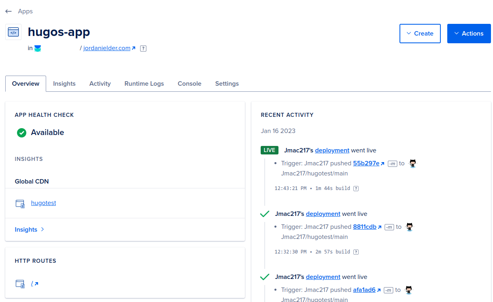

+++
title = "Building a Hugo Blog Website with Digital Ocean and GitHub"
date = "2023-01-16T12:58:41-06:00"
author = ""
authorTwitter = "" #do not include @
cover = "images/HugoSiteThumb.png"
tags = ["hugo", "blog", "development"]
keywords = ["hugo", "blog", "development", "digital ocean", "github"]
description = "Hugo is a popular and efficient static site generator, written in Go, that offers a fast and easy way to create websites. It requires no server setup or database, and it allows for customization of the site's appearance using pre-made or custom themes. We'll go through the process of starting your own blog in this article!"
showFullContent = false
readingTime = true
hideComments = false
color = "" #color from the theme settings
+++

# What is a *Hugo*?

Firstly welcome to the world of static sites! If you're new to the concept, a static site is a website that is built using plain HTML, CSS, and JavaScript files, as opposed to a dynamic site that is generated on the fly using a server-side language like PHP or Ruby.

One of the most popular tools for building static sites is [Hugo](https://gohugo.io/). Hugo is a static site generator written in [Go](https://go.dev/), and it's known for its speed and ease of use. With Hugo, you can create a website in minutes, without having to worry about setting up a server or a database!

One of the key benefits of using Hugo is that it's incredibly fast. Since your website is just a bunch of static files, it can be served to your visitors quickly and efficiently. This means that your website will load faster, which is great for both your visitors and your search engine rankings.

Another benefit of using Hugo is that it's extremely easy to use. You can create a new website by simply running a single command, and then you can add pages and content to your site by creating new markdown files. You can also use Hugo to create a custom theme for your website, which means you can make it look exactly the way you want it to.

Overall, Hugo is a great choice for building your next static website. It's fast, easy to use, and highly customizable. So if you're looking for a simple and powerful way to create a website, let's go ahead and get moving!

# Download a Few Things to Get Started

NOTE: I will be using [Digital Ocean](https://cloud.digitalocean.com/)  and [GitHub](https://github.com/) (not sponsored) like the article title implies, but you can also use [Linode](https://www.jupiterbroadcasting.com/sponsors/) and [GitLab](https://gitlab.com/gitlab-org/gitlab) or other tools for these concepts.

If you don't currently have a Digital Ocean account [use this link](https://tuxdigital.com/sponsors/) to get extra credits, it doesn't support me, but it does support Destination Linux, which is a podcast I like.

* [Hugo](https://gohugo.io/)
* [Git](https://git-scm.com/)

on Fedora Linux you can run:  
```txt
sudo dnf install git hugo
```

and same with apt on the Debian derivatives, you know the drill.

# Create Your Site

Now that the installation is taken care of, navigate to your desired directory, mine is `~/hugo`:

```bash
mkdir ~/hugo
cd ~/hugo
hugo new site mydomain.com
cd mydomain.com
git init
```
* don't close this window just yet, we'll be right back here

on Windows use these commands instead:  
```powershell
cd %userprofile%
mkdir hugo
cd hugo
hugo new site mydomain.com
cd mydomain.com
git init
```
* don't close this window just yet, we'll be right back here

replace `mydomain.com` with your own domain name, and if you do not already own a Domain I recommend [GoDaddy](https://dashboard.godaddy.com/venture), not sponsored. The reason I recommend them is due to the ease of use in their dashboard. We'll get to the steps of getting a Domain if you don't already have one, but first we need to build our site locally and make it our own!

You'll have noticed this particular bit of output when you ran the `hugo new site` command:  


we'll be adding a theme next but firstly let's just see what we have going so far by running:

```bash
hugo server
```


* this is my actual local development server for this site which is why my numbers are not set lower to `0` like a new site would be

# The Local Server Is Now Running
don't exit this window, but do note that near the end of the output, there is a line that reads:
```txt
Web Server is available at http://localhost:1313/
```

on Linux you can `Ctrl+LeftClick` to open the link in your web browser, and on Windows CMD you have to highlight the text and `Right Click` to copy the text, then paste that link into your web browser URL.

If all goes accordingly you should now be staring at a blank white screen... That's not what we want our site to look like, but we're about to change it. And before we go changing things we want to start adding things to our local git Repo to be later pushed to github.  

We've already initialized our website directory as a git repo when we ran the above command `git init` so now we can add `git submodules` to our repo. To do this firstly we need to figure out which theme we want to add. Go to this site to browse the official themes list:  

https://themes.gohugo.io/

# *This* Site is Built with Hugo and Digital Ocean
Just like this article goes on to explain how to do, but before we can go on to host the site, we have to have it looking like we want it. The first step in any Hugo site was just done, creating the site, but next we need to *serve* the site locally so we can see our changes as we make them, and most importantly before anyone else can. I've landed on [Terminal](https://themes.gohugo.io/themes/hugo-theme-terminal/) for my theme on this website, but want to use a Resume theme for one and a blog theme for another. To use any theme from https://themes.gohugo.io/ select the **Download** button and you'll be taken to a GitHub page.


# A Few Theme Options

I'm going to show a few different variations of websites, but by this point you should be following your own theme's instructions. If you want to follow any of these themes, then we'll continue. Otherwise meet me back here once your theme is installed and we'll go through the `GitHub` and `Digital Ocean` steps down below

Now go back to your terminal window and use `Ctrl+C` to end the server instance so we can add our theme. Once the server stopped and you can type again follow the instructions on your theme's GitHub page. If you're following with this theme the following steps are from its GitHub:  

# Option #1: Resume Site

For this part I'll be using the [Simple CV Theme](https://themes.gohugo.io/themes/simple-cv/). Once you've made your way to your selected theme's [GitHub page](https://github.com/hootan09/simple-cv)


```bash
git submodule add https://github.com/hootan09/simple-cv.git themes/simple-cv
```
and copy in the example site information from the theme
```bash
cp -a themes/simple-cv/exampleSite/. .
```
and run:
```bash
hugo server
```

when going back to `http://localhost:1313/` you should see the Author's CV is what's here by default, but now you can go on to edit everything that was copied from the theme, which are the following:
```txt
├── config.toml
├── data
│   ├── content.yaml
│   └── fa
│       └── content.yaml
└── static
    └── img
        └── avatar.jpg
```

Edit these files to your liking and skip the blog section for the next set of instructions!

# Option #2: Blog Site

So I also want to go through the steps of getting a blog website up too

For this I'll be using the [hugo-paper theme](https://themes.gohugo.io/themes/hugo-paper/)

https://github.com/nanxiaobei/hugo-paper


```bash
git submodule add https://github.com/nanxiaobei/hugo-paper themes/paper
```
and copy this into your `config.toml`:

```toml
baseURL = 'http://example.org/'
languageCode = 'en-us'
title = 'My New Hugo Site'
disqusShortname = 'YOUR_DISQUS_SHORTNAME'   # use disqus comments

[params]
  # color style
  color = 'linen'                           # linen, wheat, gray, light

  # header social icons
  twitter = 'YOUR_TWITTER_ID'               # twitter.com/YOUR_TWITTER_ID
  github = 'YOUR_GITHUB_ID'                 # github.com/YOUR_GITHUB_ID
  instagram = 'YOUR_INSTAGRAM_ID'           # instagram.com/YOUR_INSTAGRAM_ID
  mastodon = 'YOUR_MASTODON_LINK'           # e.g. 'https://mastodon.instance/@xxx'
  rss = true                                # show rss icon

  # home page profile
  avatar = 'GRAVATAR_EMAIL'                 # gravatar email or image url
  name = 'YOUR_NAME'
  bio = 'YOUR_BIO'


  # misc
  disableHLJS = true                        # disable highlight.js
  monoDarkIcon = true                       # show monochrome dark mode icon
  gravatarCdn = 'GRAVATAR_CDN_LINK'         # e.g. 'https://cdn.v2ex.com/gravatar/'
  graphCommentId = "YOUR_GRAPH_COMMENT_ID"  # use graph comment (disqus alternative)
```

and replace the the personal information with your info.

and also I always make sure to go into `archetypes/default.md` and replace `draft: true` to `draft: false`:
```markdown
---
title: "{{ replace .Name "-" " " | title }}"
date: {{ .Date }}
draft: false
---


```
so that the next command will populate the page as soon as its created, and when I want to create a draft I'll switch it back off on a page-by-page basis.

now one last thing, we do need to add a post, and the way I like to do this is the following:

```bash
hugo new posts/my-first-post/index.md
```
this creates a new *index.md* file at `content/posts/my-first-post/index.md` and anything you create in this folder can be accessed by that index.md file, so I went ahead and created an images folder here too:
```
mkdir content/posts/my-first-post/images
```
and I copied my old discord avatar in as a `test.png` there.

As for the `index.md` that was created, in this example all I added was:
```md
---
title: "My First Post"
date: 2023-01-16T15:55:59-06:00
draft: false
---

# This is the header


```

make sure your server is running by this point:

```bash
hugo server
```

and you'll see something like:


# Other Options

There are many styles of Hugo Sites and they all have a slightly different setup process, but they all follow a general set of instructions. As you dig deeper the file hierarchy will make more sense!

# Hosting Your Site

If this is your first time purchasing a domain take note that we will not need to purchase anything extra from GoDaddy besides the domain name. All of our storage and name resolution will take place on Digital Ocean's servers. Your price should not be more than your advertised domain cost for this type of website.

on GoDaddy now that you have your domain and you're logged into your account, you'll have a lot of options, but the only one you need to worry about for the lifetime of this site is going to the [GoDaddy Dashboard](https://account.godaddy.com/products) and beside your domain name click **DNS** and scroll down to the **Nameservers** section.

Select the **Change** button and replace each of the nameservers with:  


---  

Select the tiny font at the bottom:  

`Enter my own nameservers (Advanced)`  


---  

Place the following Nameserver Domains into the fields like the picture shows:   
`ns1.digitalocean.com`  
`ns2.digitalocean.com`  
`ns3.digitalocean.com`  


One of the major hurdles in [Getting Started with GitHub](https://docs.github.com/en/get-started) is setting up your [SSH key](https://github.com/settings/keys), and if you've never done that before [the official documentation](https://docs.github.com/en/authentication/connecting-to-github-with-ssh/generating-a-new-ssh-key-and-adding-it-to-the-ssh-agent) is the best place to go for information, however I will attempt to recap the steps required here:  


on all platforms you should have access to the `ssh-keygen` command, but in case you're having issues running the commands maybe try [an application from this list](https://www.ssh.com/academy/ssh/windows), I recommend [PuTTY](https://www.putty.org/) which comes with an application called `PuTTYgen` but the usage of that tool is beyond the scope of this article.

open a `terminal` or `command prompt` on windows and use the following commands to get your desired key pair:  

```bash
ssh-keygen -t ed25519 -C "your_email@example.com"
```
use the email address you used to sign up with *GitHub*

usually the defaults are okay, press enter a few times, and make sure that you enter a password for your safety.

and add it to the keyring:  
```bash
ssh-add ~/.ssh/id_ed25519
```

on Windows the path is typically `C:\Users\USERNAME\.ssh\` so you'd run:
```cmd
ssh-add C:\Users\USERNAME\.ssh\id_ed25519
```
* replace `USERNAME` with your profile name on Windows

now open your `~/.ssh/id_ed25519.pub` file in a text editor and copy the contents into the [GitHub Textbox](https://github.com/settings/keys) and assign it a name of your choice


# After Your Site is Up and Running and Your GitHub Key is Linked
and you've edited the personal information to your liking

While you're still on GitHub go ahead and create the repo, without initializing it, we've already done that locally. We just need to have get a link to this repo.


Follow the steps you're presented with:


Don't worry about copying the link from the top of the final page, but remember your `username` and your `repository name` for the next step:  


and you can issue the following commands:

```bash
git remote add origin git@github.com:USERNAME/REPOSITORY.git
git add .
git commit -m "initial commit"
git push origin master
```
- Replace `USERNAME` and `REPOSITORY` with your GitHub username and the repo you want to publish

and when you're finished you'll be able to go back to that final page and see that it's been updated with something similar to:  


Now that our site is set to use Digital Ocean's Nameservers let's go over to our [Digital Ocean Dashboard](https://cloud.digitalocean.com/apps) and get our `App` set up!  

be sure that if you don't have an account you take advantage of [some free credit](https://tuxdigital.com/sponsors/)  

once we're on the [dashboard](https://cloud.digitalocean.com/apps) select the `Create App` button


Link your Digital Ocean account from here with your GitHub, and it will present the repo to your site in the dropdown. If you don't see it for some reason, unlink and re-link your account. I actually had to do that the first time.

Select your branch either `main` or `master` and leave the source directory `/` and `autodeploy` checked

You're welcome to rename your deployment, but everything else can be left as default and you should be able to run on a starter plan for Apps as of this point in time which will only cost $1.00/mo

After everything looks good hit Create Resources and you should be able to go back to your [Digital Ocean Dashboard](https://cloud.digitalocean.com/apps) and the domain management should prompt you near the top of the dashboard to enter your domain, and Digital Ocean will handle the DNS routes for you.

By the end of the process you should have a deployment linked to your GitHub posts



# To Add More Posts

```bash
hugo new posts/name-of-your-new-post/index.md
mkdir posts/name-of-your-new-post/images
```

* to remove any posts just delete the folder
* to rename a post just rename the folder

# If You're New to Markdown  

check out the [Markdown Guide](https://www.markdownguide.org/getting-started/)

and also check out the [source files for this website](https://github.com/Jmac217/hugotest/tree/main/content/posts)