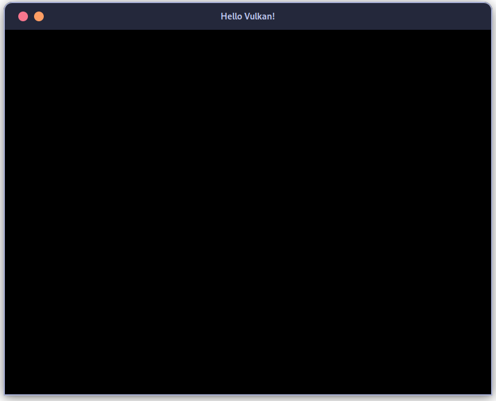
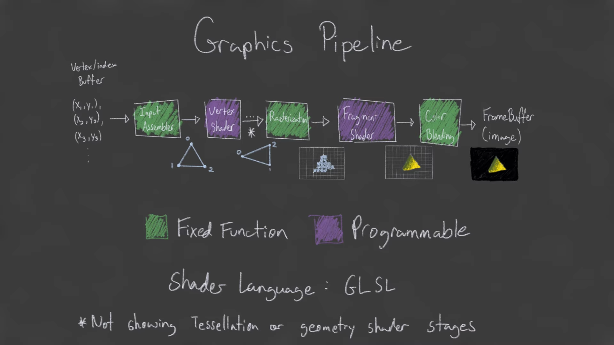
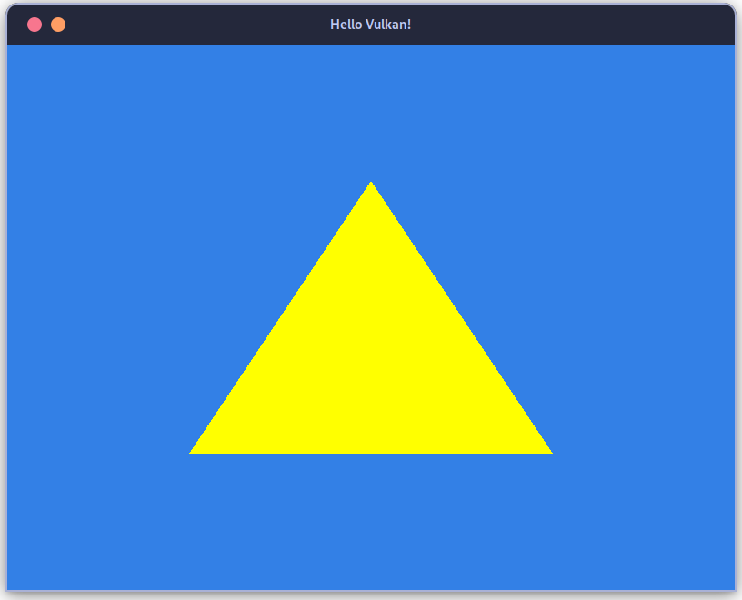

+++
title = "Building a Triangle with Vulkan and C++ in Fedora 37"
date = "2023-01-14T18:23:21-06:00"
author = ""
authorTwitter = "" #do not include @
cover = "images/Vulkan-C++-Thumb.png"
tags = ["C++", "CMake", "Vulkan", "GLFW", "Fedora", "Linux"]
keywords = ["C++", "CMake", "Vulkan", "GLFW", "Fedora", "Linux"]
description = "What makes a Triangle less than simple in Vulkan is that by starting a Vulkan project you're signing up for plenty of up-front thoughts of what you're building, as well as filling-in the fields that Vulkan expects of Graphical Applications both small and massive."
showFullContent = false
readingTime = true
hideComments = false
color = "" #color from the theme settings
fullWidthTheme = true
+++

# Navigation
* [Beginning the Journey](#Beginning)
* [Pre-requisites](#PreRequisites)
* [The Material](#Material)
* [Downloading The Boilerplate](#Download)
* [VulkanSDK](#VulkanSDK)
* [DNF](#DNF)
* [CMake](#CMake)
* [Testing Vulkan](#Test)
* [Starting Line](#StartingLine)
* [Window Notes](#Moves)
* [Initial Directory Structure](#Notes)
* [Vulkan Window](#Window)
* [FirstApp Class](#FirstApp)
* [JdeWindow Class](#JdeWindow)
* [Main Function](#main)
* [Launching the Window](#Open)
* [The Hard Part](#HardPart)
* [Full Directory Structure](#TriDir)
* [Shader Chain](#ShaderChain)
* [Shader Compilation](#ShaderCompile)
* [Starting The Triangle](#Triangle)
* [Revamped first_app.hpp](#FirstTriangleHpp)
* [Revamped first_app.cpp](#FirstTriangleCpp)
* [Graphics Pipeline Configuration jde_pipeline.hpp](#PipelineHpp)
* [Graphics Pipeline Configuration jde_pipeline.cpp](#PipelineCpp)
* [Revamped jde_window.hpp](#WindowHpp)
* [Revamped jde_window.cpp](#WindowCpp)
* [Build The Triangle](#BuildTriangle)
* [Launch The Triangle!](#Launch)

# Beginning the Journey {#Beginning}

I've been looking at Vulkan from afar for 6 months while I honed my C++ skills and worked through SFML, GLFW, and OpenGL, along with a few windowing frameworks like ImGui and GTK3, but all of that work just barely prepared me for this most arduous of tasks... The legendary Vulkan Triangle! Settle in, this is going to take some time to even read through, let alone work through!

I sat down about ~~8 hours ago~~ yesterday, now at the time of finishing the post, thinking this might not be so bad, and in some ways it's not *that bad*, but comparing it to everything I've done till now, it is the *hardest thing* I've had to comprehend in programming. What makes a Triangle less than simple in Vulkan is that by simply starting a Vulkan project you're signing up for plenty of up-front thinking through the architecture of what you're building as well as filling in the fields that Vulkan expects of Graphical Applications both small and massive. The tried and true OpenGL was pretty dang quick to get up and running and gave you a sense of *"I can do this!"*, but then at every turn there was something to add to your API, and if you didn't know it was coming it could derail your project to the point of no return. Having gone through a few of the stumbling points with OpenGL I had *some* idea of what I was getting into with Vulkan, but not nearly enough to think twice about sitting down with it tonight. **TL;DR: Vulkan forces you to double check your vision before stepping into the pitfalls you'll surely encounter with OpenGL.**

All of the content from this post summarizes the first 6 videos of [Brendan Galea's](https://www.youtube.com/watch?v=Y9U9IE0gVHA&list=PL8327DO66nu9qYVKLDmdLW_84-yE4auCR) Vulkan Game Engine YouTube Series.

---

# Pre-requisites {#PreRequisites}
This must be the longest list of pre-requisites I've seen in a post, let-alone a post I wrote, but it's all of the things you need to get going on Fedora Linux *version 37 at the time of writing this*.

# The Material {#Material}
I didn't set out to follow a tutorial, but I absolutely had to, and everyone recommended [Brendan Galea's Vulkan Game Engine Tutorial](https://www.youtube.com/watch?v=Y9U9IE0gVHA&list=PL8327DO66nu9qYVKLDmdLW_84-yE4auCR) over the last few months of casually looking into this. I decided that it was going to be the quickest way to get up and running in a manner that would allow me to continue learning and would align with my overall plans for Vulkan, which is to incorporate it into an game engine for myself to learn with.

I'm going to use [Brendan's tutorial](https://www.youtube.com/watch?v=Y9U9IE0gVHA&list=PL8327DO66nu9qYVKLDmdLW_84-yE4auCR) as reference for some of the points I talk about, but mostly I'm going to make his process more specific to Linux and even more specifically Fedora. Fedora makes for a great workstation, so that's where I've been spending my last few months.

# Download These And Make Edits Accordingly {#Download}

[Brendan](https://www.youtube.com/watch?v=Y9U9IE0gVHA&list=PL8327DO66nu9qYVKLDmdLW_84-yE4auCR) has 4 files hosted that you'll need to download and follow his short instructions on what to change in those files, these links will take you to the timestamp in the videos, as well as to the download location within the description of the videos.

* [lve_device.cpp & lve_device.hpp](https://www.youtube.com/watch?v=LYKlEIzGmW4&t=94s)
* [lve_swap_chain.cpp & lve_swap_chain.hpp](https://www.youtube.com/watch?v=IUYH74MqxOA&t=194s)

---

# VulkanSDK {#VulkanSDK}
The biggest thing to get going up front is to [Download the VulkanSDK](https://vulkan.lunarg.com/sdk/home#linux) and get it properly set up in your environment for use with `glslc`.

When you get the `SDK - SDK Installer` `vulkansdk-linux-x86_64-1.3.236.0.tar.gz` (at the time of writing this) file downloaded, follow the next few commands to get the ball rolling on this setup process. NOTE: There's a script in the tar archive that is supposed to make it easy to install, but it didn't work for me, so I created a new directory at `~/VulkanSDK` and moved our tar into it:
```bash
mkdir ~/VulkanSDK
cd ~/VulkanSDK
tar -xzvf vulkansdk-linux-x86_64-1.3.236.0.tar.gz
cd 1.3.236.0/x86_64
pwd
```
`pwd` will output the `path` you'll need for the `$VULKAN_SDK` environment variable
```txt
/home/USERNAME/VulkanSDK/1.3.236.0/x86_64
```
From there you can copy that `path` and use it for the following instructions.  
since most people are using `BASH` I'll post the instructions for that first,  
but I'll go into detail about the `fish` solution as well!

```bash
export VULKAN_SDK="/home/USERNAME/VulkanSDK/1.3.236.0/x86_64/"
export PATH="$VULKAN_SDK/bin:$PATH"
```
Run those in your terminal to add them temporarily, or add them to your `~/.bashrc` or `~/.bash_profile` or somewhere else you can think of.

Next up the solution that [Fish Shell](https://fishshell.com/) users have to live with:
```bash
set -gx VULKAN_SDK "/home/USERNAME/VulkanSDK/1.3.236.0/x86_64/"
fish_add_path $VULKAN_SDK/bin/
```
those are now added permenantly to your path, you can overwrite them them with the same command if you make a typo, or clear them entirely with another `set` command.

# You should now be able to run `glslc`
test this by issuing a simple:  
```bash
glslc --version
```
and you should see:  
```text
shaderc v2022.4 v2022.4
spirv-tools v2022.5-dev v2022.4-28-gd9446130
glslang 11.1.0-605-g728c6895

Target: SPIR-V 1.0
```

# DNF {#DNF}

 Now that the manual setup is out of the way is out of the way it's time to get our development environment up and going!
 
*`dnf` all the things!*
```bash
sudo dnf install \
    @"Development Tools" \
    vulkan-headers \
    vulkan-loader-devel \
    vulkan-tools \
    vulkan-validation-layers \
    vulkan-devel \
    libcxx-devel \
    libcxx \
    glm-devel \
    cmake \
    libpng-devel \
    wayland-devel \
    libpciaccess-devel \
    libX11-devel \
    libXpresent \
    libxcb \
    xcb-util \
    libxcb-devel \
    libXrandr-devel \
    xcb-util-keysyms-devel \
    xcb-util-wm-devel \
    python3 \
    git \
    lz4-devel \
    libzstd-devel \
    python3-distutils-extra \
    qt \
    gcc-g++ \
    wayland-protocols-devel \
    ninja-build \
    python3-jsonschema \
    qt5-qtbase-devel \
    qt \
    xinput \
    libXinerama
```

## CMake {#CMake}

My preferred build generator is CMake even with its blemishes. I've used a few dirty tricks to get this going quickly.

## `CmakeLists.txt`
```cmake
# CMakeLists.txt

cmake_minimum_required(VERSION 3.25)
project(Vulkan-Starter)

# Set C++ standard to a proper standard
set(CMAKE_CXX_STANDARD 20)

# Add the GLFW and Vulkan libraries
find_package(glfw3 REQUIRED)
find_package(Vulkan REQUIRED)
find_package(glm REQUIRED)

# Copy contents of src/shaders to the binary location
add_custom_target(copy_assets
    COMMAND ${CMAKE_COMMAND} -E copy_directory ${CMAKE_CURRENT_LIST_DIR}/src/shaders
    ${CMAKE_CURRENT_BINARY_DIR}/src/shaders
)

# Dirty way to add all source files in the ./src directory
file(GLOB_RECURSE SRC_FILES "src/*.cpp")

# Create the executable
add_executable(Vulkan-Starter ${SRC_FILES})

# Link our executable against the libraries
target_link_libraries(Vulkan-Starter glfw)
target_link_libraries(Vulkan-Starter Vulkan::Vulkan)
target_link_libraries(Vulkan-Starter glm::glm)
add_dependencies(Vulkan-Starter copy_assets)
```  
>A `CMakeLists.txt` file is used to configure C and C++ projects with CMake, ours is called "Vulkan-Starter".

* This config sets the C++ standard to version 20, which is the latest version of C++ for now! *I'm impatiently waiting for C++23 this year!*

* We'll use the `find_package` command to locate and include the `GLFW`, `Vulkan` and `GLM` libraries, which are required for the `project`.

* Create a custom target that I've named `copy_assets` which copies the contents of the `src/shaders` directory to the binary directory, the directory where the executable gets built.

* I opted to use `file(GLOB_RECURSE SRC_FILES "src/*.cpp")` to add all source files in the `src/` directory to the `SRC_FILES` variable... This is not a recommended option for modern CMake, but it does work, and *before release* you'd want to do a full revamp on the `CMakeLists.txt` file anyway.

* Finally we create an executable called `Vulkan-Starter` using the `add_executable` command and links it against the `GLFW`, `Vulkan`, and `GLM` libraries using the `target_link_libraries` command.

* The way that assets are handled is with a dependency between the `executable` and the custom target `copy_assets` using the `add_dependencies` command so that the *assets* are *copied before* the executable is built.

## Testing Vulkan {#Test}

This file can be copied to use as a test for your environment. If you don't have any errors then you're ready to move on!

# `main.cpp`
```cpp
// main.cpp

#define GLFW_INCLUDE_VULKAN
#include "GLFW/glfw3.h"

#define GLM_FORCE_RADIANS
#define GLM_FORCE_DEPTH_ZERO_TO_ONE
#include "glm/mat4x4.hpp"
#include "glm/vec4.hpp"
#include <iostream>

int main()
{
    glfwInit();
    glfwWindowHint(GLFW_CLIENT_API, GLFW_NO_API);
    GLFWwindow* window = glfwCreateWindow(800, 600, "Vulkan Window", nullptr, nullptr);

    uint32_t extensionCount = 0;
    vkEnumerateInstanceExtensionProperties(nullptr, &extensionCount, nullptr);

    std::cout << extensionCount << " extensions supported\n";

    glm::mat4 matrix;
    glm::vec4 vec;

    auto test = matrix * vec;

    while (!glfwWindowShouldClose(window))
    {
        glfwPollEvents();
    }

    glfwDestroyWindow(window);

    glfwTerminate();

    return 0;
}
```
This is just a simple introduction to the world of Vulkan graphics programming! Ultimately this file should open a GLFW window.

* Our entrypoint starts by initializing the `GLFW` library, which we use to create a window that will serve as the canvas for our Vulkan graphics. We then specify that we want to use the *Vulkan client API*, and create a window with a width of 800 pixels, a height of 600 pixels, and the title "Vulkan Window".

* Next, we use the `vkEnumerateInstanceExtensionProperties` function to determine the number of extensions supported by the current system. This information is then output to the console. My number was 20, but yours could be anything depending on your machine.

* We also utilize the `GLM` library for some matrix and vector operations, specifically creating a *4x4 matrix* and a *4-element vector*, and then performing a *matrix-vector multiplication*.

* Finally, we enter a loop that repeatedly polls for events and continues running as long as the window remains open. Once the window is closed, we clean up by destroying the window and shutting down `GLFW`.

* Overall, this program serves as a basic introduction to some key concepts and libraries in the world of Vulkan programming, and is a great starting point for our upcoming triangle.

# The Starting Line {#StartingLine}


[SPIR-V](https://www.khronos.org/spir/) is the format that Vulkan expects for our shaders which is why we had to download VulkanSDK and get `glslc` added to the path
The `CMakeLists.txt` sets up everything our project will need  
and the `main.cpp` file utilizes GLFW to create a Window and logs the number of extensions supported by `vkEnumerateInstanceExtensionProperties`  
which in my case is `20 extensions supported` and is the only use for this file.  
Since the purpose of this `main.cpp` was to simply test our installation you may now remove all of the code from it and follow along with [Brendan Galea's Vulkan Game Engine Tutorial series on YouTube](https://www.youtube.com/watch?v=Y9U9IE0gVHA&list=PL8327DO66nu9qYVKLDmdLW_84-yE4auCR)

---

# Let's Make Some Moves! {#Moves}

Getting a *window* up and running with `Vulkan` is exactly the same as it would be with `OpenGL` and `GLFW`. I am very glad to have had a chance to play with GLFW when I did to smooth out this process!  

I always prefer to start from the last file written and work my way backwards to the first. It usually layers properly in my brain that way, so we'll be starting with `first_app.cpp` and work our way backwards ending with `main.cpp`.

---

## Code Notes {#Notes}

* anything you see that has `jde` or `Jde` is something that I changed, and is something that *YOU* can also change! In the [videos]() you'll notice these are originally `lve` and `Lve` but you should change these to something for yourself as it helps with the learning process.
* every translation unit is namespaced with `jde` which was also originally `lve` in the tutorial

we're starting with a small directory structure that will just create a GLFW window:  

```txt
├── CMakeLists.txt                      BUILDS PROJECT
└── src
    ├── first_app.cpp                   
    ├── first_app.hpp                   CLASS "FirstApp"
    ├── jde_window.cpp                  
    ├── jde_window.hpp                  CLASS "JdeWindow"
    └── main.cpp                        ENTRY POINT
```
* **remember** it's totally encouraged to change anything named `jde` or `Jde` to your liking, but the two **are** case sensitve!

---

# Starting The Vulkan Window {#Window}

# The `FirstApp` Class {#FirstApp}
>calls `FirstApp::run()` in the `jde` namespace which contains a `while` loop that repeatedly calls `glfwPollEvents()` until the `jdeWindow` member variable of the `FirstApp` class returns `true` for the `shouldClose()` method. This is our `Game Loop`.
## `first_app.cpp`
```cpp
// first_app.cpp

#include "first_app.hpp"

namespace jde {

    void FirstApp::run()
    {
        while (!jdeWindow.shouldClose())
        {
            glfwPollEvents();
        }
    }
}
```

## `first_app.hpp`
```cpp
// first_app.hpp

#pragma once

#include "jde_window.hpp"

namespace jde {

    class FirstApp {
    public:
        static constexpr int WIDTH = 800;
        static constexpr int HEIGHT = 600;
        void run();
    private:
        JdeWindow jdeWindow{WIDTH, HEIGHT, "Hello Vulkan!"};
    };
}
```
note that we are including `jde_window.hpp` in the header in this file; the header for our `FirstApp` class in the `jde` namespace. This is where we define the `WIDTH` and `HEIGHT` of the application as `static constexpr int`, and at a resolution of `800x600`. Finally the `private method` `jdeWindow` is initialized with our height and width when `run()` is called and our game loop begins;

---

### The `JdeWindow` Class {#JdeWindow}

# `jde_window.hpp`

```cpp
#pragma once

#define GLFW_INCLUDE_VULKAN
#include <GLFW/glfw3.h>
#include <string>

namespace jde {
    class JdeWindow {
    public:
        JdeWindow(int w, int h, std::string name);
        ~JdeWindow();
        JdeWindow(const JdeWindow &) = delete;
        JdeWindow &operator=(const JdeWindow &) = delete;

        bool shouldClose() {
            return glfwWindowShouldClose(window);
        }
    private:
        void initWindow();

        const int width;
        const int height;

        std::string windowName;
        GLFWwindow *window;
    };
}
```
this is our window class `JdeWindow`, its constructor takes a `w`, `h`, and a `name` which are used to initialize the `width`, `height`, and `name` of the window. We properly handle the available constructors, and the destructor destroys the window and terminates GLFW. The class has *deleted `copy constructor` and copy `assignment operator`*, which means that instances of this class cannot be copied. This is where our `game loop` is requested to terminate. `JdeWindow` has a public method called `shouldClose()`, which returns a bool indicating whether the window has been closed or not. Finally there is also one private method `initWindow()` that actually initializes the window. The private variables store width, height, and the name of the GLFW window.

# `jde_window.cpp`

```cpp
// jde_window.cpp

#include "jde_window.hpp"

namespace jde {

    JdeWindow::JdeWindow(int w, int h, std::string name):
        width{w}, height{h}, windowName{name}
    {
        initWindow();
    }

    JdeWindow::~JdeWindow()
    {
        glfwDestroyWindow(window);
        glfwTerminate();
    }

    void JdeWindow::initWindow()
    {
        glfwInit();
        glfwWindowHint(GLFW_CLIENT_API, GLFW_NO_API);
        glfwWindowHint(GLFW_RESIZABLE, GLFW_FALSE);

        window = glfwCreateWindow(width, height, windowName.c_str(), nullptr, nullptr);
    }
}
```
* `jde_window.cpp` code starts by including the `jde_window.hpp` header file, which contains declarations for the `JdeWindow` class.
* our namespace `jde` is defined.
* The `JdeWindow` class is defined, which has a constructor that takes in three parameters: `width`, `height`, and a *string* `name`.
* In the `constructor`, the input parameters are assigned to the *member variables* of the class. Then the function `initWindow()` is called.
* A `destructor` is defined, which is called when the `JdeWindow` object is destroyed. It destroys the window and terminates `GLFW`.
* The `initWindow()` function is defined, which initializes `GLFW` and sets some *window hints*.
* The `GLFW` library is initialized.
* The `GLFW_CLIENT_API` hint is set to `GLFW_NO_API` to indicate that no graphics API is used
* The `GLFW_RESIZABLE` hint is set to `GLFW_FALSE` to indicate that the window is *not resizable*
* A *window* is created with the specified `width`, `height` and `name`.
* The *window pointer* is assigned to the window member variable.

### Making Entry in `main.cpp`! {#main}
> We now get to hit the `run()` command we saw very first! This is the `main()` function of the application, which is the entry point of our window! 
```cpp
#include "first_app.hpp"

#include <cstdlib>
#include <iostream>
#include <stdexcept>

int main()
{
    jde::FirstApp app{};

    try {
        app.run();
    } catch (const std::exception &e) {
        std::cerr << e.what() << '\n';
        return EXIT_FAILURE;
    }

    return EXIT_SUCCESS;
}
```

Our entrypoint creates an instance of our `FirstApp` class, which was defined in `first_app.hpp`, and calls `run()`; which is responsible for executing our main loop aka game loop, which just keeps running as long as the window is open. This loop keeps running as long as the window is open, by `polling` the `events` from the `window`. I like to use the powerful C++ standard when I can and haven't had the opportunity to use *try-catch blocks* in a real-world application yet, so this tutorial has me happy for that. The main function also includes a try-catch block that catches any *exceptions* that are thrown by the `run()` method. If an `exception` is caught, the *error message* is printed to the *standard error output* and the program exits with the failure status code: `EXIT_FAILURE`; otherwise, if the program exits without an `exception`, it will return the `EXIT_SUCCESS` status code.

# Opening the Window to the World of Vulkan! {#Open}

Run the following `CMake` command *if you're not using something like Emacs or VS Code*:
```bash
cmake -B ./build -S .
```
and you should see around the same output as:
```txt
-- The C compiler identification is GNU 12.2.1
-- The CXX compiler identification is GNU 12.2.1
-- Detecting C compiler ABI info
-- Detecting C compiler ABI info - done
-- Check for working C compiler: /usr/bin/cc - skipped
-- Detecting C compile features
-- Detecting C compile features - done
-- Detecting CXX compiler ABI info
-- Detecting CXX compiler ABI info - done
-- Check for working CXX compiler: /usr/bin/c++ - skipped
-- Detecting CXX compile features
-- Detecting CXX compile features - done
-- Found Vulkan: /lib64/libvulkan.so (found version "1.3.216") found components: glslc glslangValidator 
-- Configuring done
-- Generating done
-- Build files have been written to: /home/mac/Documents/Projects/C++/Vulkan/build
```

>changing into the *build directory* and issuing a `make` command is next:
```bash
cd build
make
```
or I found that you can run `make` from anywhere using the `-C` flag `make -C build`  
in any case you should see something similar to the following output:
```txt
[  0%] Built target copy_assets
[ 14%] Building CXX object CMakeFiles/Vulkan-Starter.dir/src/first_app.cpp.o
[ 28%] Building CXX object CMakeFiles/Vulkan-Starter.dir/src/jde_device.cpp.o
[ 42%] Building CXX object CMakeFiles/Vulkan-Starter.dir/src/jde_pipeline.cpp.o
[ 57%] Building CXX object CMakeFiles/Vulkan-Starter.dir/src/jde_swap_chain.cpp.o
[ 71%] Building CXX object CMakeFiles/Vulkan-Starter.dir/src/jde_window.cpp.o
[ 85%] Building CXX object CMakeFiles/Vulkan-Starter.dir/src/main.cpp.o
[100%] Linking CXX executable Vulkan-Starter
[100%] Built target Vulkan-Starter
```
the last line says `Built target Vulkan-Starter` is what matters, that's our binary!

now we can change into the build directory, if you're not already there `cd build`, and launch our ~~GLFW~~ Vulkan Window!

```bash
./Vulkan-Starter
```



and with any luck you'll have a fully functional GLFW window that doesn't immediately exit, but also doesn't do anything!

# Unfortunately That Was the Easy Part {#HardPart}

Next we have to build out the entire Vulkan graphics pipeline and an API to interface with the Graphics Card.

  
- image credit to Brendan Galea - Vulkan Game Engine Tutorial 2

# Directory Structure for the Vulkan Triangle {#TriDir}

You'll need to download these 4 files if you haven't grabbed them yet!
* [lve_device.cpp & lve_device.hpp](https://www.youtube.com/watch?v=LYKlEIzGmW4&t=94s)
* [lve_swap_chain.cpp & lve_swap_chain.hpp](https://www.youtube.com/watch?v=IUYH74MqxOA&t=194s)
* *if you watch the section of the video he talks about the edits you will need to make to those files! Basically it comes down to the namespace and the first few letters of the class name, and each method of the class.*

and create 5 more:
* `glslc.sh`
* `jde_pipeline.cpp`
* `jde_pipeline.hpp`
* `shaders/simple_shader.frag`
* `shaders/simple_shader.vert`

my project directory tree AFTER [video #7](https://youtu.be/_VOR6q3edig?list=PL8327DO66nu9qYVKLDmdLW_84-yE4auCR):  

* the `.spv` are the compiled output from `glslc` which we're getting to soon
```txt
├── CMakeLists.txt                      BUILDS PROJECT
└── src
    ├── first_app.cpp                   
    ├── first_app.hpp                   CLASS "FirstApp"
    ├── glslc.sh                        COMPILES SHADERS
    ├── jde_device.cpp                  
    ├── jde_device.hpp                  CLASS "JdeDevice"
    ├── jde_pipeline.cpp                
    ├── jde_pipeline.hpp                CLASS "JdePipeline"
    ├── jde_swap_chain.cpp              
    ├── jde_swap_chain.hpp              CLASS "JdeSwapChain"
    ├── jde_window.cpp                  
    ├── jde_window.hpp                  CLASS "JdeWindow"
    ├── main.cpp                        ENTRY POINT
    └── shaders
        ├── simple_shader.frag          SPIR-V FRAGMENT SHADER
        ├── simple_shader.frag.spv      COMPILED SPIR-V FROM GLSLC
        ├── simple_shader.vert          SPIR-V VERTEX SHADER
        └── simple_shader.vert.spv      COMPILED SPIR-V FROM GLSLC
```

---

# One Nice Thing About the Shader Chain {#ShaderChain}
we can really only program two stages of the shader chain in Vulkan, the `Vertex Shader` and the `Fragment Shader`, which are right here:  
# `src/shaders/simple_shader.frag`
is our fragment shader, responsible for determining the color of each pixel on the screen.
```HLSL
#version 450

layout (location =0) out vec4 outColor;

void main()
{
    outColor = vec4(1.0, 1.0, 0.1, 1.0);
}
```
 It defines a single output variable "outColor", which is a 4-component vector representing the red, green, blue, and alpha (transparency) values of the pixel. In the main function, the outColor variable is set to a fixed value of (1.0, 1.0, 0.1, 1.0), which corresponds to a bright yellow color with full opacity.

---

# `src/shaders/simple_shader.vert`
is our vertex shader, which is responsible for determining the position of each vertex in the 3D space.
```HLSL
#version 450

vec2 positions[3] = vec2[](
    vec2(0.0, -0.5),
    vec2(0.5, 0.5),
    vec2(-0.5, 0.5)
);

void main() {
    gl_Position = vec4(positions[gl_VertexIndex], 0.0, 1.0);
}
```
It defines an array "positions" of 2D vectors, which represent the coordinates of three vertices. This shader will be used to draw the triangle on the screen using the provided vertex positions.

---

# Shaders Are Done, Now Let's Compile! {#ShaderCompile}

and that's the last time we'll have to touch those before we get a Triangle on-screen, but that's a ways off still. First we now need to utilize our VulkanSDK to run `glslc`. In the video he uses this script which works just fine in `bash`, so from `fish` I've just been launching a `bash` shell to run this `src/glslc.sh` file:
```bash
#!/bin/bash

$VULKAN_SDK/bin/glslc shaders/simple_shader.vert -o shaders/simple_shader.vert.spv
$VULKAN_SDK/bin/glslc shaders/simple_shader.frag -o shaders/simple_shader.frag.spv
```

Make sure that you change the mode of our file for executuion with  `chmod`:
```bash
chmod +x src/glslc.sh
```
and finally
```bash
./src/glslc.sh
```
should run do the thing

It won't tell you if you got it right, but `glslc` complain nicely if something didn't go right.

if you're using `fish` you may as well just go to `BASH` like I did:

```bash
bash ./src/glslc.sh
```
or
```bash
bash
./src/glslc.sh
```
to get a full shell environment up. If your environment variables aren't working, make sure you've logged out of your user session since adding anything to your `~/.bashrc` or `~/.bash_profile`. If it really isn't working just use the commands from the script as a guide to work through the process manually.  

I didn't go as far as incorporating the shader compilation step into the `CMakeLists.txt` file's `copy_assets` function just yet, but that's still something I will go on and do. I'll update this post if/when it happens.

# Toward The TRIANGLE! {#Triangle}

The GLFW window we wrote is about to get Vulkanized, and this page is going to start looking like [GitHub](https://github.com/Jmac217/Vulkan-Starter-Engine)!  

As Brendan Stated in the [tutorial](https://youtu.be/LYKlEIzGmW4?t=94), there's a lot of extra boilerplate that gets in the way and does not need to be thought about at this stage. By following the tutorial beyond the point of this triangle example

There are 4 files to download from the tutorial and at very least the namespace will need to be changed to `jde` in those downloads. It's not proper etiquate to link directly to those files, and you should watch those parts of the videos anyway to really see what to change in the files.  

* [lve_device.cpp & lve_device.hpp](https://www.youtube.com/watch?v=LYKlEIzGmW4&t=94s)
* [lve_swap_chain.cpp & lve_swap_chain.hpp](https://www.youtube.com/watch?v=IUYH74MqxOA&t=194s)

We're jumping right to the Tringle BTW, these next couple of files are the only things we still need!

# The expanded `first_app.hpp` {#FirstTriangleHpp}
```cpp
#pragma once

#include "jde_window.hpp"
#include "jde_pipeline.hpp"
#include "jde_device.hpp"
#include "jde_swap_chain.hpp"

#include <memory>
#include <vector>

namespace jde {

    class FirstApp {
    public:
        static constexpr int WIDTH = 800;
        static constexpr int HEIGHT = 600;
        
        FirstApp();
        ~FirstApp();

        FirstApp(const FirstApp &) = delete;
        FirstApp &operator=(const FirstApp &) = delete;
        
        void run();

    private:
        void createPipelineLayout();
        void createPipeline();
        void createCommandBuffers();
        void drawFrame();

        JdeWindow jdeWindow{WIDTH, HEIGHT, "Hello Vulkan!"};
        JdeDevice jdeDevice{jdeWindow};
        JdeSwapChain jdeSwapChain{jdeDevice, jdeWindow.getExtent()};
        std::unique_ptr<JdePipeline> jdePipeline;
        VkPipelineLayout pipelineLayout;
        std::vector<VkCommandBuffer> commandBuffers;

    };
}
```
Our `FirstApp` class has a *default* `constructor` and `destructor` and a still similar `run()` method.

* The `constructor` now creates a *pipeline layout*, pipeline, and *command buffers*.

* The `destructor` now destroys the *pipeline layout*.

* The `run()` method is still our main loop in the application, it polls events and now calls the `drawFrame` method.

* The `createPipelineLayout` method creates a *pipeline layout* for the pipeline. It sets the layout count and push constant range count to 0 and creates the *pipeline layout*.  

* The `createPipeline` method creates a pipeline and assigns the *render pass* and *pipeline layout* to it.

* The `createCommandBuffers` method resizes the *command buffers* vector to the size of the *swap chain* images. It allocates *command buffers* and begins recording them. It sets up a *render pass*, clears the color and depth values, and binds the pipeline and draws a triangle.

* The `drawFrame` method acquires an image from the *swap chain*, and begins and ends the command buffer while submitting to the mailbox queue.

and the accompanying translation unit is rather large:
# `first_app.cpp` Just Got A Lot Bigger! {#FirstTriangleCpp}
```cpp
#include "first_app.hpp"

#include <stdexcept>
#include <array>

namespace jde {

    FirstApp::FirstApp()
    {
        createPipelineLayout();
        createPipeline();
        createCommandBuffers();
    }

    FirstApp::~FirstApp()
    {
        vkDestroyPipelineLayout(jdeDevice.device(), pipelineLayout, nullptr);
    }

    void FirstApp::run()
    {
        while (!jdeWindow.shouldClose())
        {
            glfwPollEvents();
            drawFrame();
        }
    }

    void FirstApp::createPipelineLayout()
    {
        VkPipelineLayoutCreateInfo pipelineLayoutInfo{};
        pipelineLayoutInfo.sType = VK_STRUCTURE_TYPE_PIPELINE_LAYOUT_CREATE_INFO;
        pipelineLayoutInfo.setLayoutCount = 0;
        pipelineLayoutInfo.pSetLayouts = nullptr;
        pipelineLayoutInfo.pushConstantRangeCount = 0;
        pipelineLayoutInfo.pPushConstantRanges = nullptr;
        if (vkCreatePipelineLayout(jdeDevice.device(), &pipelineLayoutInfo, nullptr, &pipelineLayout) != VK_SUCCESS)
        {
            throw std::runtime_error("failed to create pipeline layout!");
        }
    }

    void FirstApp::createPipeline()
    {
        auto pipelineConfig = JdePipeline::defaultPipelineConfigInfo(jdeSwapChain.width(), jdeSwapChain.height());
        pipelineConfig.renderPass = jdeSwapChain.getRenderPass();
        pipelineConfig.pipelineLayout = pipelineLayout;
        jdePipeline = std::make_unique<JdePipeline>(
            jdeDevice, 
            "src/shaders/simple_shader.vert.spv", 
            "src/shaders/simple_shader.frag.spv", 
            pipelineConfig);
    }

    void FirstApp::createCommandBuffers()
    {
        commandBuffers.resize(jdeSwapChain.imageCount());

        VkCommandBufferAllocateInfo allocInfo{};
        allocInfo.sType = VK_STRUCTURE_TYPE_COMMAND_BUFFER_ALLOCATE_INFO;
        allocInfo.level = VK_COMMAND_BUFFER_LEVEL_PRIMARY;
        allocInfo.commandPool = jdeDevice.getCommandPool();
        allocInfo.commandBufferCount = static_cast<uint32_t>(commandBuffers.size());

        if(vkAllocateCommandBuffers(jdeDevice.device(), &allocInfo, commandBuffers.data())!= VK_SUCCESS)
        {
            throw std::runtime_error("failed to allocate command buffers!");
        }

        for (int i = 0; i < commandBuffers.size(); i++)
        {
            VkCommandBufferBeginInfo beginInfo{};
            beginInfo.sType = VK_STRUCTURE_TYPE_COMMAND_BUFFER_BEGIN_INFO;

            if (vkBeginCommandBuffer(commandBuffers[i], &beginInfo) != VK_SUCCESS)
            {
                throw std::runtime_error("failed to begin recording command buffers!");
            }

            VkRenderPassBeginInfo renderPassInfo{};
            renderPassInfo.sType = VK_STRUCTURE_TYPE_RENDER_PASS_BEGIN_INFO;
            renderPassInfo.renderPass = jdeSwapChain.getRenderPass();
            renderPassInfo.framebuffer = jdeSwapChain.getFrameBuffer(i);

            renderPassInfo.renderArea.offset = {0, 0};
            renderPassInfo.renderArea.extent = jdeSwapChain.getSwapChainExtent();

            std::array<VkClearValue, 2> clearValues{};
            clearValues[0].color = {0.2f, 0.5f, 0.9f, 1.0f};
            clearValues[1].depthStencil = {1.0f, 0};
            renderPassInfo.clearValueCount = static_cast<uint32_t>(clearValues.size());
            renderPassInfo.pClearValues = clearValues.data();

            vkCmdBeginRenderPass(commandBuffers[i], &renderPassInfo, VK_SUBPASS_CONTENTS_INLINE);

            jdePipeline->bind(commandBuffers[i]);
            vkCmdDraw(commandBuffers[i], 3, 1, 0, 0);

            vkCmdEndRenderPass(commandBuffers[i]);
            if (vkEndCommandBuffer(commandBuffers[i]) != VK_SUCCESS)
            {
                throw std::runtime_error("failed to record command buffer");
            }

        }
    }

    void FirstApp::drawFrame()
    {
        uint32_t imageIndex;
        auto result = jdeSwapChain.acquireNextImage(&imageIndex);

        if (result != VK_SUCCESS && result != VK_SUBOPTIMAL_KHR)
        {
            throw std::runtime_error("imageIndex failed to acquire swap chain image!");
        }

        result = jdeSwapChain.submitCommandBuffers(&commandBuffers[imageIndex], &imageIndex);
        if (result != VK_SUCCESS)
        {
            throw std::runtime_error("result failed to acquire swap chain image!");
        }
    }
}
```

FirstApp `constructor`:
* creates a *pipeline layout*
* creates a pipeline
* creates *command buffers*

FirstApp `destructor`:
* destroys the *pipeline layout*

`FirstApp::run()`:
* enters a loop that polls events and calls the `drawFrame` method as long as the window is not closed

`FirstApp::createPipelineLayout()`:
* creates a *pipeline layout* with no set layouts or push constant ranges

`FirstApp::createPipeline()`:
* creates a pipeline with the render pass and *pipeline layout* from the `JdeSwapChain` and `JdePipeline` classes, and assigns it to the `jdePipeline` *member variable*

`FirstApp::createCommandBuffers()`:
* resizes the *command buffers* vector to the number of images in the *swap chain*
allocates *command buffers* and begins recording them
* sets up a render pass, clears the color and depth values, and binds the pipeline and draws a triangle

`FirstApp::drawFrame()`:
acquires an image from the *swap chain*
begins and ends the *command buffer* and submits it to the mailbox queue

# Vulkan Graphics Pipeline Configuration {#PipelineHpp}

# `jde_pipeline.hpp`
```cpp
#pragma once

#include "jde_device.hpp"

#include <string>
#include <vector>

namespace jde {

    struct PipelineConfigInfo {
        VkViewport viewport;
        VkRect2D scissor;
        VkPipelineViewportStateCreateInfo viewportInfo;
        VkPipelineInputAssemblyStateCreateInfo inputAssemblyInfo;
        VkPipelineRasterizationStateCreateInfo rasterizationInfo;
        VkPipelineMultisampleStateCreateInfo multisampleInfo;
        VkPipelineColorBlendAttachmentState colorBlendAttachment;
        VkPipelineColorBlendStateCreateInfo colorBlendInfo;
        VkPipelineDepthStencilStateCreateInfo depthStencilInfo;
        VkPipelineLayout pipelineLayout = nullptr;
        VkRenderPass renderPass = nullptr;
        uint32_t subpass = 0;
    };

    class JdePipeline {
        public:
        JdePipeline(
            JdeDevice &device, 
            const std::string& vertFilepath, 
            const std::string& fragFilepath, 
            const PipelineConfigInfo& configInfo);
        ~JdePipeline();
        JdePipeline(const JdePipeline&) = delete;
        void operator=(const JdePipeline&) = delete;

        void bind(VkCommandBuffer commandBuffer);

        static PipelineConfigInfo defaultPipelineConfigInfo(uint32_t width, uint32_t height);

        private:
        
        static std::vector<char> readFile(const std::string& filepath);
        void createGraphicsPipeline(
            const std::string& vertFilepath, 
            const std::string& fragFilepath, 
            const PipelineConfigInfo& configInfo);

        void createShaderModule(const std::vector<char>& code, VkShaderModule* shaderModule);

        // implicitly will outlive any class that depends on it. "aggregation"
        JdeDevice& jdeDevice;
        VkPipeline graphicsPipeline;
        VkShaderModule vertShaderModule;
        VkShaderModule fragShaderModule;
    };
}
```
This code is defining a class called `JdePipeline` in the `jde` namespace. The class has a `constructor`, `destructor`, and a function called `bind()`.

* The `constructor` takes in a `JdeDevice` object, the file paths for a `vertex shader` and `fragment shader`, and a `PipelineConfigInfo` struct.

* The `destructor` will clean up the *pipeline* and *shader modules*. The `bind()` function is used to *bind* the *pipeline* to a *command buffer*.

* The `JdePipeline` class also has a static function called `defaultPipelineConfigInfo()` that returns a `PipelineConfigInfo` struct with default values for its member variables.

* The class has a *private function* called `createGraphicsPipeline()` that creates the *pipeline* using the provided configuration and *shaders*.

* It also has a private function called `createShaderModule()` that creates a shader module from the provided code.

The class has a member variable `graphicsPipeline` of type `VkPipeline`, which will store the *pipeline* object.

* It also has two *member variables* of type `VkShaderModule`, which will store the `vertex shader` and `fragment shader` modules.

* The class also has a reference to the `JdeDevice` object, which is passed in through the `constructor` and is used to interact with the device throughout the lifetime of the *pipeline*.

and the massive list of groupings of definitions lie ahead:


# `jde_pipeline.cpp` {#PipelineCpp}
```cpp
#include "jde_pipeline.hpp"

#include <fstream>
#include <stdexcept>
#include <iostream>
#include <cassert>

namespace jde {

    JdePipeline::JdePipeline(
            JdeDevice &device, 
            const std::string& vertFilepath, 
            const std::string& fragFilepath, 
            const PipelineConfigInfo& configInfo):
            jdeDevice{device}
    {
        createGraphicsPipeline(vertFilepath, fragFilepath, configInfo);
    }

    JdePipeline::~JdePipeline()
    {
        vkDestroyShaderModule(jdeDevice.device(), vertShaderModule, nullptr);
        vkDestroyShaderModule(jdeDevice.device(), fragShaderModule, nullptr);
        vkDestroyPipeline(jdeDevice.device(), graphicsPipeline, nullptr);
    }

    std::vector<char> JdePipeline::readFile(const std::string& filepath)
    {
        std::ifstream file{filepath, std::ios::ate | std::ios::binary};

        if (!file.is_open())
        {
            throw std::runtime_error("failed to open file: " + filepath);
        }

        size_t fileSize = static_cast<size_t>(file.tellg());
        std::vector<char> buffer(fileSize);

        file.seekg(0);
        file.read(buffer.data(), fileSize);

        file.close();
        return buffer;
    }

    void JdePipeline::createGraphicsPipeline(
        const std::string& vertFilepath, 
        const std::string& fragFilepath, 
        const PipelineConfigInfo& configInfo)
    {
        assert(configInfo.pipelineLayout != VK_NULL_HANDLE &&
        "Cannot create graphics pipeline:: no pipelineLayout provided in configInfo");
        assert(configInfo.renderPass != VK_NULL_HANDLE &&
        "Cannot create graphics pipeline:: no pipelineLayout provided in configInfo");
        auto vertCode = readFile(vertFilepath);
        auto fragCode = readFile(fragFilepath);

        createShaderModule(vertCode, &vertShaderModule);
        createShaderModule(fragCode, &fragShaderModule);

        VkPipelineShaderStageCreateInfo shaderStages[2];
        shaderStages[0].sType = VK_STRUCTURE_TYPE_PIPELINE_SHADER_STAGE_CREATE_INFO;
        shaderStages[0].stage = VK_SHADER_STAGE_VERTEX_BIT;
        shaderStages[0].module = vertShaderModule;
        shaderStages[0].pName = "main";
        shaderStages[0].flags = 0;
        shaderStages[0].pNext = nullptr;
        shaderStages[0].pSpecializationInfo = nullptr;

        shaderStages[1].sType = VK_STRUCTURE_TYPE_PIPELINE_SHADER_STAGE_CREATE_INFO;
        shaderStages[1].stage = VK_SHADER_STAGE_FRAGMENT_BIT;
        shaderStages[1].module = fragShaderModule;
        shaderStages[1].pName = "main";
        shaderStages[1].flags = 0;
        shaderStages[1].pNext = nullptr;
        shaderStages[1].pSpecializationInfo = nullptr;

        VkPipelineVertexInputStateCreateInfo vertexInputInfo{};
        vertexInputInfo.sType = VK_STRUCTURE_TYPE_PIPELINE_VERTEX_INPUT_STATE_CREATE_INFO;
        vertexInputInfo.vertexAttributeDescriptionCount = 0;
        vertexInputInfo.vertexBindingDescriptionCount = 0;
        vertexInputInfo.pVertexAttributeDescriptions = nullptr;
        vertexInputInfo.pVertexBindingDescriptions = nullptr;

        VkPipelineViewportStateCreateInfo viewportInfo{};
        viewportInfo.sType = VK_STRUCTURE_TYPE_PIPELINE_VIEWPORT_STATE_CREATE_INFO;
        viewportInfo.viewportCount = 1;
        viewportInfo.pViewports = &configInfo.viewport;
        viewportInfo.scissorCount = 1;
        viewportInfo.pScissors = &configInfo.scissor;

        VkGraphicsPipelineCreateInfo pipelineInfo{};
        pipelineInfo.sType = VK_STRUCTURE_TYPE_GRAPHICS_PIPELINE_CREATE_INFO;
        pipelineInfo.stageCount = 2;
        pipelineInfo.pStages = shaderStages;
        pipelineInfo.pVertexInputState = &vertexInputInfo;
        pipelineInfo.pInputAssemblyState = &configInfo.inputAssemblyInfo;
        pipelineInfo.pViewportState = &viewportInfo;
        pipelineInfo.pRasterizationState = &configInfo.rasterizationInfo;
        pipelineInfo.pMultisampleState = &configInfo.multisampleInfo;

        pipelineInfo.pColorBlendState = &configInfo.colorBlendInfo;
        pipelineInfo.pDepthStencilState = &configInfo.depthStencilInfo;
        pipelineInfo.pDynamicState = nullptr;

        pipelineInfo.layout = configInfo.pipelineLayout;
        pipelineInfo.renderPass = configInfo.renderPass;
        pipelineInfo.subpass = configInfo.subpass;

        pipelineInfo.basePipelineIndex = -1;
        pipelineInfo.basePipelineHandle = VK_NULL_HANDLE;

        if (vkCreateGraphicsPipelines(
            jdeDevice.device(), 
            VK_NULL_HANDLE, 
            1, 
            &pipelineInfo, 
            nullptr, 
            &graphicsPipeline) != VK_SUCCESS)
            {
                throw std::runtime_error("failed to create graphics pipeline");
        }
    }

    void JdePipeline::createShaderModule(const std::vector<char>& code, VkShaderModule* shaderModule)
    {
        VkShaderModuleCreateInfo createInfo{};
        createInfo.sType = VK_STRUCTURE_TYPE_SHADER_MODULE_CREATE_INFO;
        createInfo.codeSize = code.size();
        createInfo.pCode = reinterpret_cast<const uint32_t*>(code.data());

        if (vkCreateShaderModule(jdeDevice.device(), &createInfo, nullptr, shaderModule) != VK_SUCCESS)
        {
            throw std::runtime_error("failed to create shader module");
        }
    }

    void JdePipeline::bind(VkCommandBuffer commandBuffer)
    {
        vkCmdBindPipeline(commandBuffer, VK_PIPELINE_BIND_POINT_GRAPHICS, graphicsPipeline);
    }

    PipelineConfigInfo JdePipeline::defaultPipelineConfigInfo(uint32_t width, uint32_t height)
    {
        PipelineConfigInfo configInfo{};

        configInfo.inputAssemblyInfo.sType = VK_STRUCTURE_TYPE_PIPELINE_INPUT_ASSEMBLY_STATE_CREATE_INFO;
        configInfo.inputAssemblyInfo.topology = VK_PRIMITIVE_TOPOLOGY_TRIANGLE_LIST;
        configInfo.inputAssemblyInfo.primitiveRestartEnable = VK_FALSE;

        configInfo.viewport.x = 0.0f;
        configInfo.viewport.y = 0.0f;
        configInfo.viewport.width = static_cast<float>(width);
        configInfo.viewport.height = static_cast<float>(height);
        configInfo.viewport.minDepth = 0.0f;
        configInfo.viewport.maxDepth = 1.0f;

        configInfo.scissor.offset = {0, 0};
        configInfo.scissor.extent = {width, height};

        configInfo.rasterizationInfo.sType = VK_STRUCTURE_TYPE_PIPELINE_RASTERIZATION_STATE_CREATE_INFO;
        configInfo.rasterizationInfo.depthClampEnable = VK_FALSE;
        configInfo.rasterizationInfo.rasterizerDiscardEnable = VK_FALSE;
        configInfo.rasterizationInfo.polygonMode = VK_POLYGON_MODE_FILL;
        configInfo.rasterizationInfo.lineWidth = 1.0f;
        configInfo.rasterizationInfo.cullMode = VK_CULL_MODE_NONE;
        configInfo.rasterizationInfo.frontFace = VK_FRONT_FACE_CLOCKWISE;
        configInfo.rasterizationInfo.depthBiasEnable = VK_FALSE;
        configInfo.rasterizationInfo.depthBiasConstantFactor = 0.0f;  // Optional
        configInfo.rasterizationInfo.depthBiasClamp = 0.0f;           // Optional
        configInfo.rasterizationInfo.depthBiasSlopeFactor = 0.0f;     // Optional

        configInfo.multisampleInfo.sType = VK_STRUCTURE_TYPE_PIPELINE_MULTISAMPLE_STATE_CREATE_INFO;
        configInfo.multisampleInfo.sampleShadingEnable = VK_FALSE;
        configInfo.multisampleInfo.rasterizationSamples = VK_SAMPLE_COUNT_1_BIT;
        configInfo.multisampleInfo.minSampleShading = 1.0f;           // Optional
        configInfo.multisampleInfo.pSampleMask = nullptr;             // Optional
        configInfo.multisampleInfo.alphaToCoverageEnable = VK_FALSE;  // Optional
        configInfo.multisampleInfo.alphaToOneEnable = VK_FALSE;       // Optional

        configInfo.colorBlendAttachment.colorWriteMask =
            VK_COLOR_COMPONENT_R_BIT | VK_COLOR_COMPONENT_G_BIT | VK_COLOR_COMPONENT_B_BIT |
            VK_COLOR_COMPONENT_A_BIT;
        configInfo.colorBlendAttachment.blendEnable = VK_FALSE;
        configInfo.colorBlendAttachment.srcColorBlendFactor = VK_BLEND_FACTOR_ONE;   // Optional
        configInfo.colorBlendAttachment.dstColorBlendFactor = VK_BLEND_FACTOR_ZERO;  // Optional
        configInfo.colorBlendAttachment.colorBlendOp = VK_BLEND_OP_ADD;              // Optional
        configInfo.colorBlendAttachment.srcAlphaBlendFactor = VK_BLEND_FACTOR_ONE;   // Optional
        configInfo.colorBlendAttachment.dstAlphaBlendFactor = VK_BLEND_FACTOR_ZERO;  // Optional
        configInfo.colorBlendAttachment.alphaBlendOp = VK_BLEND_OP_ADD;              // Optional

        configInfo.colorBlendInfo.sType = VK_STRUCTURE_TYPE_PIPELINE_COLOR_BLEND_STATE_CREATE_INFO;
        configInfo.colorBlendInfo.logicOpEnable = VK_FALSE;
        configInfo.colorBlendInfo.logicOp = VK_LOGIC_OP_COPY;  // Optional
        configInfo.colorBlendInfo.attachmentCount = 1;
        configInfo.colorBlendInfo.pAttachments = &configInfo.colorBlendAttachment;
        configInfo.colorBlendInfo.blendConstants[0] = 0.0f;  // Optional
        configInfo.colorBlendInfo.blendConstants[1] = 0.0f;  // Optional
        configInfo.colorBlendInfo.blendConstants[2] = 0.0f;  // Optional
        configInfo.colorBlendInfo.blendConstants[3] = 0.0f;  // Optional

        configInfo.depthStencilInfo.sType = VK_STRUCTURE_TYPE_PIPELINE_DEPTH_STENCIL_STATE_CREATE_INFO;
        configInfo.depthStencilInfo.depthTestEnable = VK_TRUE;
        configInfo.depthStencilInfo.depthWriteEnable = VK_TRUE;
        configInfo.depthStencilInfo.depthCompareOp = VK_COMPARE_OP_LESS;
        configInfo.depthStencilInfo.depthBoundsTestEnable = VK_FALSE;
        configInfo.depthStencilInfo.minDepthBounds = 0.0f;  // Optional
        configInfo.depthStencilInfo.maxDepthBounds = 1.0f;  // Optional
        configInfo.depthStencilInfo.stencilTestEnable = VK_FALSE;
        configInfo.depthStencilInfo.front = {};  // Optional
        configInfo.depthStencilInfo.back = {};   // Optional

        return configInfo;
    }
}
```
The `JdePipeline` class provides an implementation for creating a *graphics pipeline* in a Vulkan application.
* The constructor takes in a `JdeDevice` and file paths for `vertex shader` and `fragment shader`, as well as a `PipelineConfigInfo` struct containing information about the pipeline layout and render pass.
* The class uses the provided file paths to create and load a vertex and fragment shader module.
* It then uses the provided `PipelineConfigInfo` and the loaded shaders to create the *graphics pipeline*.
* The `destructor` destroys the shader modules and the *pipeline*.
* The `readFile` method reads a file and returns the contents as a vector of chars.
* The `createShaderModule` method creates a shader module from a vector of chars.
* The `createGraphicsPipeline` method sets up the *pipeline*, including specifying the *shaders*, *vertex input*, and *viewport information*.
* `defaultPipelineConfigInfo` is a helper method that returns a `PipelineConfigInfo` struct with default values for its fields. The method takes in the `width` and `height` of the `viewport`, and sets the `viewport` and `scissor` fields accordingly. It also sets default values for the `viewportInfo`, `inputAssemblyInfo`, `rasterizationInfo`, `multisampleInfo`, `colorBlendAttachment`, `colorBlendInfo`, and `depthStencilInfo` fields.
* The *pipeline layout* and *render pass* fields are initialized to `nullptr`, and the `subpass` field is initialized to `0`.
* `createGraphicsPipeline` is the method responsible for creating the *graphics pipeline*. It takes in the filepaths for the `vertex shader` and `fragment shaders`, and a `PipelineConfigInfo` struct that contains the configuration for the *pipeline*. The method starts by reading the `vertex shader` and `fragment shaders` from the filepaths, and creating shader modules from the code.
* It then sets up the `shaderStages` array with the `vertex shader` and `fragment shader` modules, and sets up the `vertexInputInfo`, `viewportInfo`, and `rasterizationInfo` structs with the appropriate values. The `multisampleInfo`, `colorBlendAttachment`, `colorBlendInfo`, and `depthStencilInfo` structs are also set up with default values.
* It then creates the *graphics pipeline* by calling `vkCreateGraphicsPipelines` with the appropriate parameters. It also *binds* the *pipeline layout* and *render pass* to the *pipeline*.

---

# A New And Improved `jde_window.hpp` Window Class {#WindowHpp}
```cpp
#pragma once

#define GLFW_INCLUDE_VULKAN
#include <GLFW/glfw3.h>
#include <string>

namespace jde {
    
    class JdeWindow {
        public:
        JdeWindow(int w, int h, std::string name);
        ~JdeWindow();

        JdeWindow(const JdeWindow &) = delete;
        JdeWindow &operator=(const JdeWindow &) = delete;

        bool shouldClose() { return glfwWindowShouldClose(window); }
        
        VkExtent2D getExtent() {
            return {
                static_cast<uint32_t>(width), 
                static_cast<uint32_t>(height)
            };
        }

        void createWindowSurface(VkInstance instance, VkSurfaceKHR *surface);

        private:
        void initWindow();

        const int width;
        const int height;

        std::string windowName;
        GLFWwindow *window;
    };
}
```
* We define a class called `JdeWindow` within the `jde` namespace.
* The `JdeWindow` class has a constructor that takes in an *integer width*, an *integer height* and a *string name*, it creates a *window* using `GLFW` library with the provided `width`, `height` and `name`.
* The `destructor` destroys the *window*, and a *copy constructor* and *assignment operator* that have been `deleted` to prevent *object copying*.
* The `shouldClose()` public method returns a boolean indicating whether the window has been marked as closed by the user or not, it uses `GLFW` library to check the status of the *window*.
* The `getExtent` public method returns the size of the *window* as a `VkExtent2D` struct, which is a struct that contains the width and height of an area.
* There is also a method called `createWindowSurface` that creates a *window surface* and assigns it to the provided pointer, it takes in a `VkInstance` and a pointer to a `VkSurfaceKHR`.
* The class also has a private method called `initWindow()` which initializes the window using `GLFW` library.
It has several *private member variables* including *width*, *height*, *windowName* and *window* which are used to store information about the *window*.

and the final piece to our triangular puzzle..!

# `jde_window.cpp` {#WindowCpp}
```cpp
#include "jde_window.hpp"

#include <stdexcept>

namespace jde {

    JdeWindow::JdeWindow(int w, int h, std::string name):
        width{w}, height{h}, windowName{name}
    {
        initWindow();
    }

    JdeWindow::~JdeWindow()
    {
        glfwDestroyWindow(window);
        glfwTerminate();
    }

    void JdeWindow::initWindow()
    {
        glfwInit();
        glfwWindowHint(GLFW_CLIENT_API, GLFW_NO_API);
        glfwWindowHint(GLFW_RESIZABLE, GLFW_FALSE);

        window = glfwCreateWindow(width, height, windowName.c_str(), nullptr, nullptr);
    }

    void JdeWindow::createWindowSurface(VkInstance instance, VkSurfaceKHR *surface)
    {
        if (glfwCreateWindowSurface(instance, window, nullptr, surface) != VK_SUCCESS)
        {
            throw std::runtime_error("failed to create window surface");
        }
    }
}
```
* The `JdeWindow` class creates a `GLFW` window with a specified `width`, `height`, and `name`. The `initWindow()` method is called in the `constructor` to initialize the `GLFW` library and create the window with the given `width`, `height`, and `name`.
* It has a `destructor` that destroys the window and terminates `GLFW`.
* The `shouldClose()` method returns a boolean indicating whether the window should be closed or not.
* The `getExtent()` method returns a `VkExtent2D` struct with the width and height of the window.
* The `createWindowSurface` method creates a `VkSurfaceKHR` for the window by calling `glfwCreateWindowSurface`, passing in the `VkInstance`, the `GLFWwindow`, and a `nullptr` for the allocation callbacks. If the return value is not `VK_SUCCESS`, it throws a runtime error *"failed to create window surface."*

# And Finally Repeat The Build Steps From Before {#BuildTriangle}
Run the following `CMake` command *if you're not using something like Emacs or VS Code*:
```bash
cmake -B ./build -S .
```
and you should see around the same output as:
```txt
-- The C compiler identification is GNU 12.2.1
-- The CXX compiler identification is GNU 12.2.1
-- Detecting C compiler ABI info
-- Detecting C compiler ABI info - done
-- Check for working C compiler: /usr/bin/cc - skipped
-- Detecting C compile features
-- Detecting C compile features - done
-- Detecting CXX compiler ABI info
-- Detecting CXX compiler ABI info - done
-- Check for working CXX compiler: /usr/bin/c++ - skipped
-- Detecting CXX compile features
-- Detecting CXX compile features - done
-- Found Vulkan: /lib64/libvulkan.so (found version "1.3.216") found components: glslc glslangValidator 
-- Configuring done
-- Generating done
-- Build files have been written to: /home/mac/Documents/Projects/C++/Vulkan/build
```

>change into the *build directory* and issue a `make` command:
```bash
cd build
make
```
or I found that you can run `make` from anywhere using the `-C` flag `make -C build`  
in any case you should see something similar to the following output:
```txt
[  0%] Built target copy_assets
[ 14%] Building CXX object CMakeFiles/Vulkan-Starter.dir/src/first_app.cpp.o
[ 28%] Building CXX object CMakeFiles/Vulkan-Starter.dir/src/jde_device.cpp.o
[ 42%] Building CXX object CMakeFiles/Vulkan-Starter.dir/src/jde_pipeline.cpp.o
[ 57%] Building CXX object CMakeFiles/Vulkan-Starter.dir/src/jde_swap_chain.cpp.o
[ 71%] Building CXX object CMakeFiles/Vulkan-Starter.dir/src/jde_window.cpp.o
[ 85%] Building CXX object CMakeFiles/Vulkan-Starter.dir/src/main.cpp.o
[100%] Linking CXX executable Vulkan-Starter
[100%] Built target Vulkan-Starter
```
the last line says `Built target Vulkan-Starter` is what matters, that's our binary!

# LAUNCH THAT TRIANGLE! {#Launch}
```bash
./build/Vulkan-Starter
```


