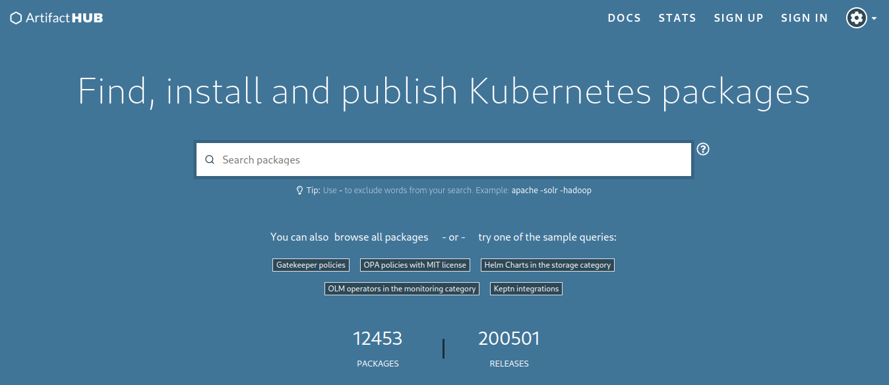
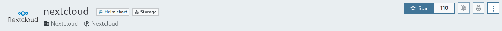
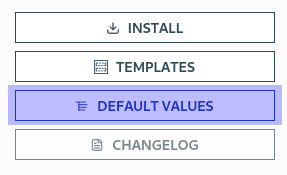
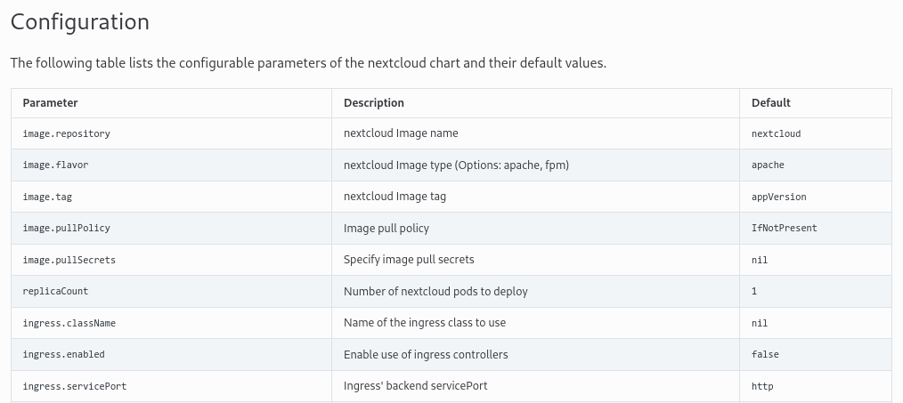
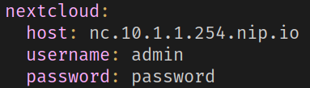
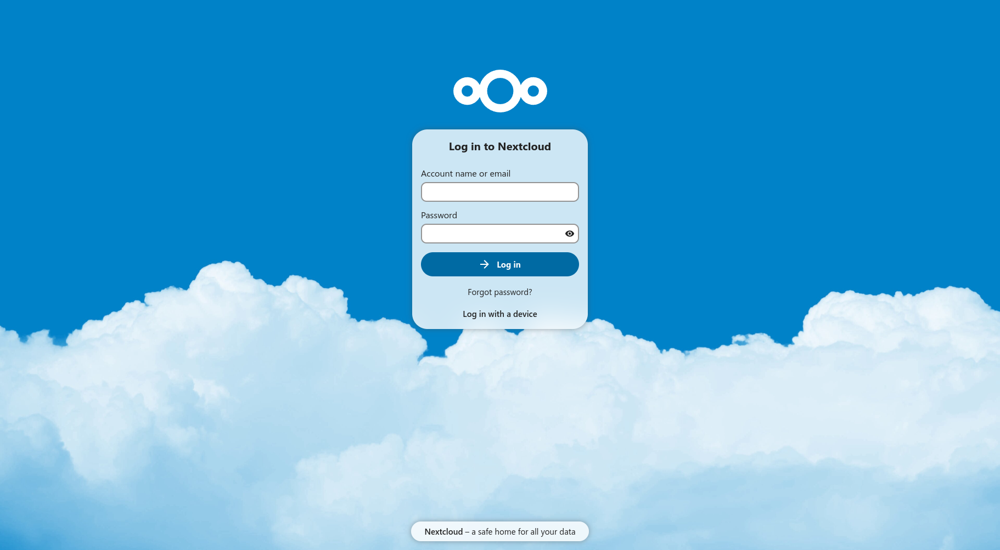
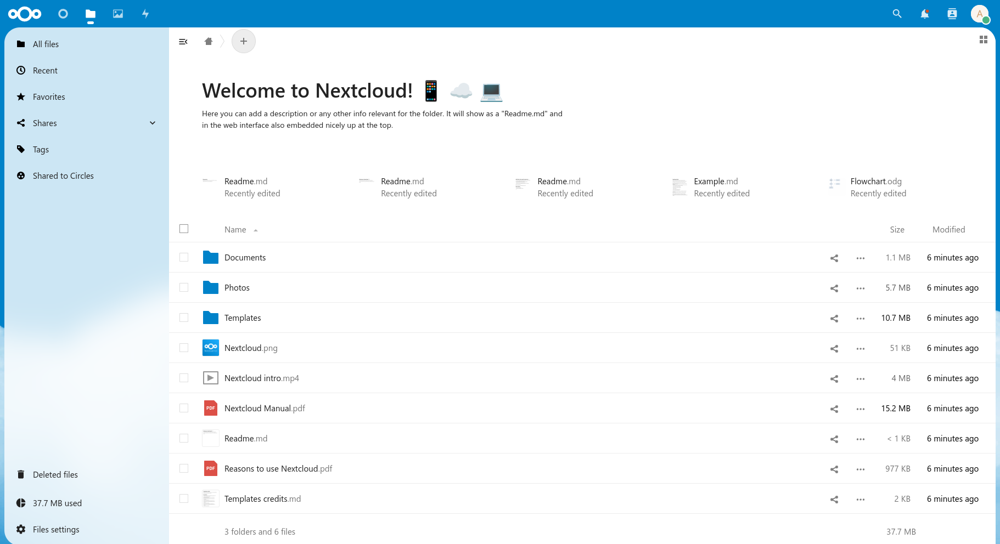

+++
title = "Helm Quick Start With Next Cloud"
date = "2023-01-21T04:57:50-06:00"
author = "Jordan"
authorTwitter = "" #do not include @
cover = "images/helm.png"
tags = ["kubernetes", "helm", "nextcloud"]
keywords = ["Helm", "Next Cloud", "Kubernetes"]
description = "Getting started with Kubernetes can be a daunting task, especially for newcomers. This is where Helm comes to smooth out the experience. Referred to as *the package manager for Kubernetes*, Helm aims to simplify the deployment of k8s applications"
showFullContent = false
readingTime = true
hideComments = false
color = "" #color from the theme settings
+++

Getting started with Kubernetes can be a daunting task, especially for newcomers. This is where Helm comes to smooth out the experience. Referred to as *the package manager for Kubernetes*, Helm aims to simplify the deployment of k8s applications, making it easier for users to harness the full potential of Kubernetes. In this guide I'll jump through the steps I took in gettin acquainted with Helm through the Next Cloud Chart.

> This guide assumes you already have a [Kubernetes](https://k21academy.com/docker-kubernetes/kubernetes-installation-options/) cluster and [Helm](https://helm.sh/docs/helm/helm_install/) installed


[Search for the App on __ArtifactHub.io__](https://artifacthub.io/)



[I'll be using the official **nextcloud** chart](https://artifacthub.io/packages/helm/nextcloud/nextcloud)



Click the button labeled **Default Values** on the right side of the screen



and either copy/paste or save the file into a location of your choice. I will be using `~/helm/nexctloud/values.yml` as my destination

This `values.yml` file is the full list of every possible change to be made to this application. This is the piece of the puzzle that everyone breezes over. You can edit any line of this file as-stated in the [documentation](https://artifacthub.io/packages/helm/nextcloud/nextcloud#configuration).



in that file you'll see plenty of things you'll wanna edit such values as host, username, password, etc... give this file a good once-over, read some of the comments and understand that what we're about to do is ephemeral, meaning there is not an underlying storage mechanism in this install of NextCloud. *This post is about Helm after all*.



and in my case I needed to add my access domain to the `config:` line *which was stated in browser the first time I loaded without that line*

```yml
configs:
  proxy.config.php: |-
    <?php
    $CONFIG = array (
      'trusted_domains' => array(
        0 => 'nc.10.1.1.254.nip.io',
      ),
    );
```

and after all that you can save the `values.yml` file and go on to **install**

```bash
helm repo add nextcloud https://nextcloud.github.io/helm/  

helm install my-release nextcloud/nextcloud --values helm/nexctloud/values.yml
```

> note that `--values helm/nextcloud/values.yml` is the location of my edited `values.yml` file

now as for *Ingress Controller* that's beyond the scope of this quickstart, but this Ingress Resource will work for Traefik and Nginx. I'm just sending it to the subdomain of `nc` and `10.1.1.254` is the address of my cluster, yours will more likely be another IP or localhost, and `nip.io` just let's you attach subdomains onto an IP address:
```yml
apiVersion: networking.k8s.io/v1
  kind: Ingress
  metadata:
    name: my-release-nextcloud
  spec:
    rules:
      - host: nc.10.1.1.254.nip.io
        http:
          paths:
          - path: /
            pathType: Prefix
            backend:
              service:
                name: my-release-nextcloud
                port:
                  number: 8080
```

and now when I visit `nc.10.1.1.254.nip.io` in my browser I see Next Cloud! You should be able to type the subdomain you provided attached to your cluster's IP and run it against [nip.io](https://nip.io/) as well for the same result: `nc.your-cluster-ip.nip.io`



and I can log in with my user with `admin` and `password` which you should have changed if you're on the public internet!



when you wanna make any changes just edit the yaml file again and run  
`helm upgrade my-release nextcloud/nextcloud --values helm/nextcloud/values.yml`

> REMINDER: we didn't attach storage to NextCloud this is for testing purposes only! Your data will not persist across upgrades. Do not stop here if you intend to deploy Next Cloud for real world use.

Happy Helming!
