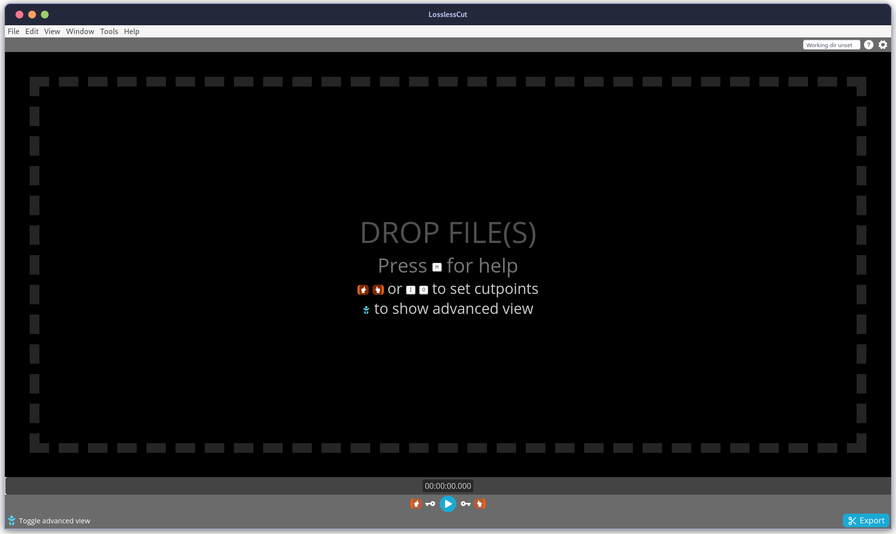
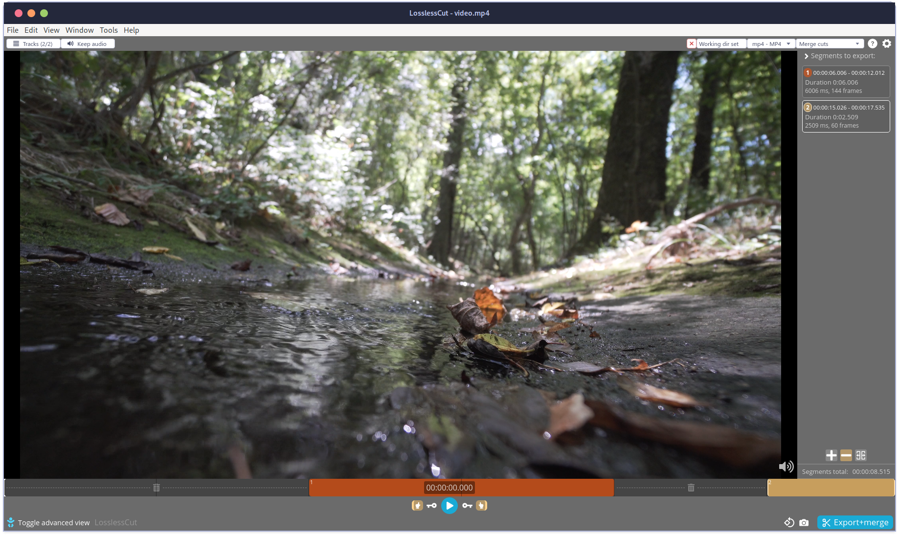
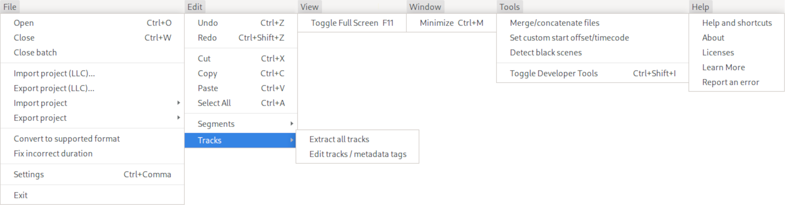
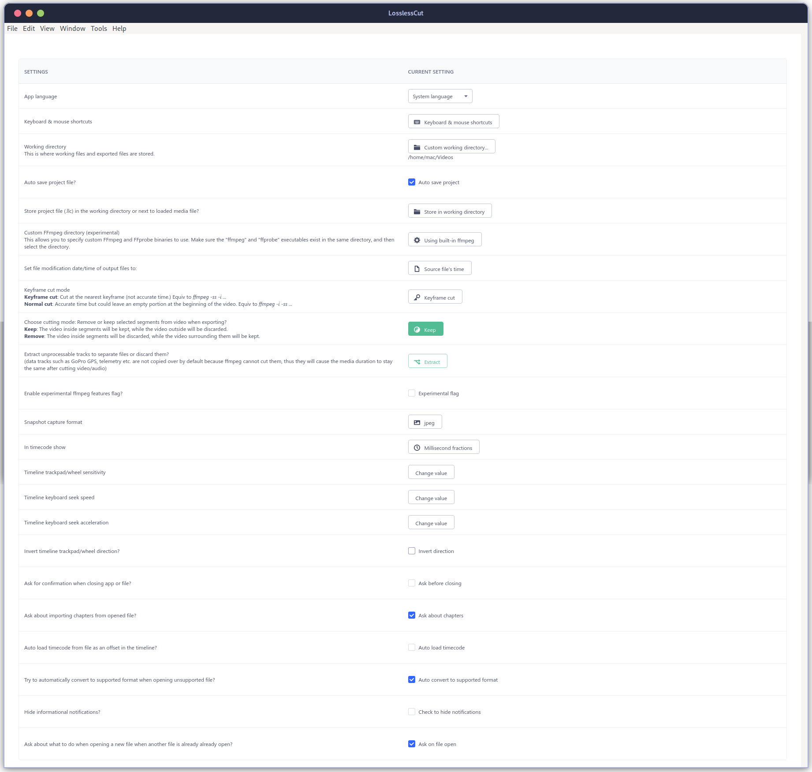
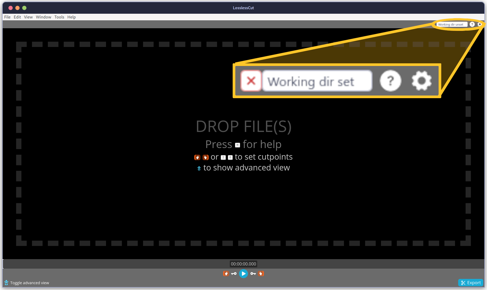
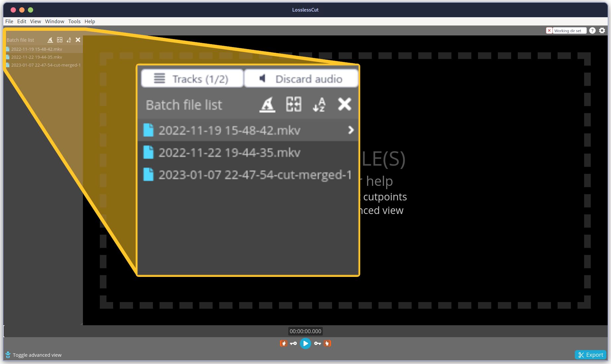
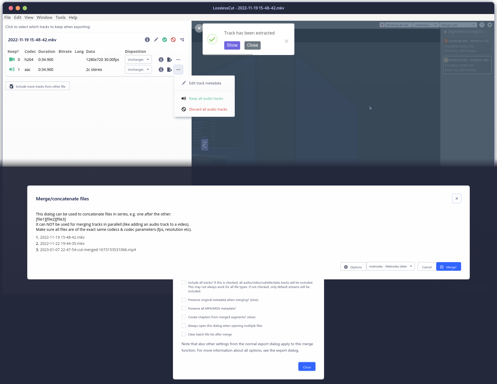
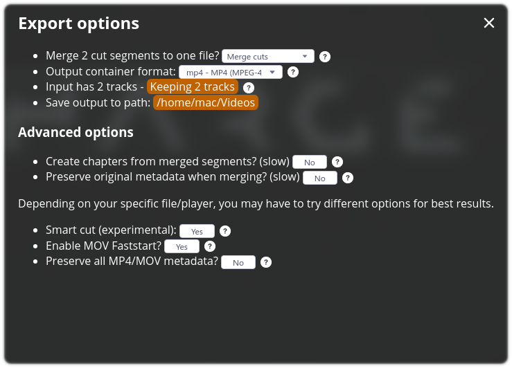
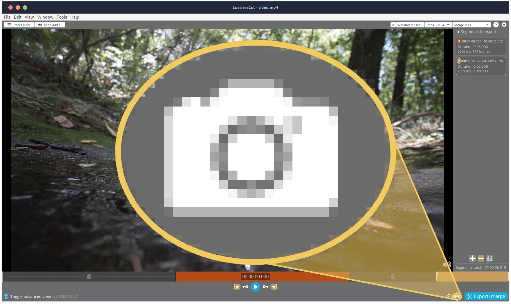

+++
title = "LosslessCut: My Most Used Video Editor"
date = "2023-01-21T04:57:50-06:00"
author = "Jordan"
authorTwitter = "" #do not include @
cover = "images/LosslessCut.png"
tags = ["LosslessCut", "Video Editing", "Open-Source"]
keywords = ["LosslessCut", "Video Editing", "Open-Source"]
description = "LosslessCut is a little-known video editor. Its a simple and efficient tool that allows users to quickly trim and cut videos without re-encoding, as well mix and merge multiple sources. You'll want to add this free and open-source tool to your workstation no matter what platform you're on."
showFullContent = false
readingTime = true
hideComments = false
color = "" #color from the theme settings
+++

Throughout my experience with Linux and Open-Source I've enjoyed many great free video-editing tools. Software like [FFmpeg]() and [ImageMagick]() have done so much of my heavy lifting over the years, and Editors like [OpenShot](), [Kdenlive](), and [Lightworks]() all have their places in my different environments; but one video editor that has made its way into my upper-eschalon of tools over the last few years is a little-known tool called [LosslessCut](https://mifi.no/losslesscut/).

`FFmpeg` is a command-line tool that is widely used for video encoding, decoding, and conversion, it can be used for a wide range of tasks including trimming, cutting, and merging videos, but it is not a full-fledged video editor like LosslessCut. It can be challenging for users who are not familiar with command-line interface to use.

`ImageMagick` is a powerful and versatile tool for working with images, but it requires a good understanding of command-line interface and the software capabilities to take full advantage of its potential.

`OpenShot` and `Kdenlive` are both open-source video editors that offer a more traditional timeline-based editing experience. They provide a wide range of features such as advanced color correction, motion graphics, 3D animation, and more. However, they may not be as efficient or as fast as `LosslessCut` when it comes to trimming and cutting videos without re-encoding.

`Lightworks` is a professional video editing software that is widely used in the film and television industry. It offers a wide range of advanced editing features and a professional-grade workflow. However, it is **not free**, and it may be too complex for users who only need to perform basic editing tasks.

# [LosslessCut](https://mifi.no/losslesscut/)  

Though I often turn to `OpenShot` for my overall video projects, I often start with FFmpeg and...

`LosslessCut` is a simple, efficient, and free video editing tool that is well-suited for quickly trimming and cutting videos without re-encoding. It may not be as feature-rich as other editors like `OpenShot`, `Kdenlive`, or `Lightworks`, but it is a good choice for users who need a fast and easy-to-use tool for basic video editing tasks.

is a simple and efficient tool that allows users to quickly trim and cut videos without re-encoding, as well mix and merge multiple sources. You'll want to add this free and open-source tool to your workstation no matter what platform you're on.

# Options

Often I will just extract all tracks for a common workflow for the band, and that's possible as soon as the file is open from the `Edit->Tracks` dropdown 

I'll go into just a little detail here about some of the different settings available in the `File->Settings` or with the keyboard shortcut `Ctrl+Comma`.

The list of settings and preferences offers a rich set of options to customize their experience when using the program, this is just a few options:

* **App language**: Allows users to select the language that the program will be displayed in.
* **Keyboard & mouse shortcuts**: Allows users to customize the keyboard and mouse shortcuts used in the program.
* **Working directory**: Allows users to specify the location where working files and exported files will be stored.
* **Auto save project file**: Allows users to enable or disable automatic saving of the project file.
* **Custom FFmpeg directory (experimental)**: Allows users to specify custom FFmpeg and FFprobe binaries to use.
* **Keyframe cut mode**: Allows users to select the cutting mode to be used when exporting videos.
* **Extract unprocessable tracks**: Allows users to specify what to do with tracks that cannot be processed.
* **Experimental ffmpeg features flag**: Allows users to enable experimental features in ffmpeg.
* **Snapshot capture format**: Allows users to select the format in which snapshots will be captured.
* **In timecode show**: Allows users to specify whether timecode is displayed in the timeline.
* **Timeline trackpad/wheel sensitivity**: Allows users to specify the sensitivity of the trackpad and wheel when navigating the timeline.
* **Auto load timecode from file**: Allows users to enable or disable the automatic loading of timecode from a file as an offset in the timeline.
* **Auto convert to supported format**: Allows users to enable or disable automatic conversion of unsupported files to a supported format when they are opened.
* **Hide informational notifications**: Allows users to enable or disable the display of informational notifications.
* **Ask about what to do when opening a new file**: Allows users to specify whether the program should ask what to do when a new file is opened while another file is already open.

# Multiple Sources
As soon you pull a video file into the program, simply dragging and dropping on most systems, you're able to export the tracks or start trimming up segments

Setting the Working Directory is where the files your exported files will be saved

If you open multiple tracks in you'll see the menu on the left to show your different video layers. You'll notice one of my tracks is has *cut-merged* in the name, that is how your files will be appended in LosslessCut.

# Multiple Tracks
since LosslessCut doesn't re-encode the video, it is very fast and since it also retains video quality. You're able to mix, merge, and concat audio and video tracks from within the batch file list.

# Lossless Export
Losslesscut is designed to handle multiple tracks. It lets you trim video tracks and export them down into tiny segment quickly. You're are able to add multiple audio tracks and switch between them, which is useful for creating a final video with multiple audio tracks (e.g. for different languages, or to add a commentary). You can trim, cut, and adjust the video tracks independently of each other and place them in different layers allowing multiple videos to be combined into a single video.

# Screenshots

LosslessCut is also a great way to grab screenshots from the video as you're working on it, so you don't have to go to external tools for that.  

# FFmpeg is still quicker for some things

Allthough FFmpeg *can* do anything that a video editor can do; LosslessCut doesn't replace FFmpeg entirely for me, there are still some tasks that I leave up to my favorite command-line tool:  

>Video Information:  
`ffmpeg -i video.mp4 -hide_banner -f null -`

and ripping audio is usually also something I'll do with FFmpeg unless it's a byproduct of a larger video project

>Basic MP4 to MP3:  
`ffmpeg -i video.mp4 audio.mp3`