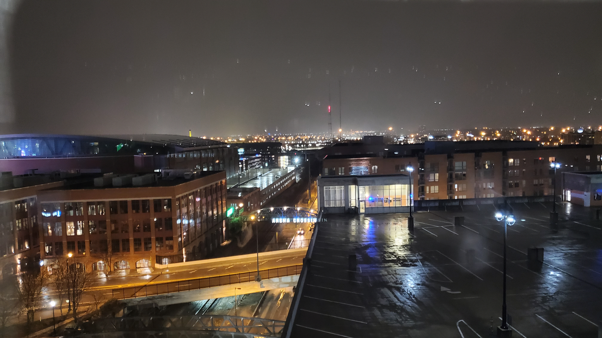

+++
title = "OLF 2022 Recap"
author = ""
authorTwitter = "" #do not include @
cover = "images/OLF-Crew.jpg"
tags = ["OLF", "Linux"]
keywords = ["Ohio", "Linux", "Fest"]
description = "The OLF Organization, led by President Beth Eicher, Vice President Warner Moore, and Chairman Vance Kochenderfer, along with other volunteer organizers, put on a successful event. Keynote speakers Amber Graner and John 'Mad Dog' Hall shared their thoughts on inclusivity in technology communities. Around 15 individuals from the Jupiter Broadcasting audience met at the North Market food court, which offers a variety of dining options including vegan, ramen, pizza, and BBQ."
showFullContent = false
readingTime = true
hideComments = false
color = "" #color from the theme settings
+++

# Thanks OLF Organization
Special thanks to President of the OLF Organization [Beth Eicher](https://olfconference.org/about/staff/), Vice President [Warner Moore](https://olfconference.org/about/staff/), Chairman [Vance Kochenderfer](https://olfconference.org/about/staff/) and the rest of the [volunteer organizers](https://olfconference.org/about/staff/) for making the event warm and welcoming, and keynote speakers [Amber Graner](https://olfconference.org/speakers/), and [John 'Mad Dog' Hall](https://olfconference.org/speakers/) spoke to being inclusive of all humans in our technology communities

# Jupiter Broadcasting Faces and Handles
 15 or probably more like 10 people from the JB audience met at [North Market](https://northmarket.org/), a food Court containing "Ohio’s best independent merchants, farmers, and makers". which had everything from Vegan to Ramen to Pizza to BBQ
Joined by   
* Nev
* the beav
* retromat
* losten
* ScorchedMuffin
* Jonathon_Bowman  
all from the Matrix chat  
* and Carl George from RedHat/CentOS
... Somehow I forgot to mention Carl George on the show. Anyways he's from RedHat how could I forget. All the RedHatters were inspiring. It was fun talking to Joshua Preston during the conference as well!

# Speakers
* Listener Jonathon Bowman started off the fest with a great talk about automating tasks with Python
* Joshua Preston from Red Hat taught me a lot about ~~Kubernetes~~ I mean Ansibel Idk why I said Kubernetes
* Tim Quinlan from F5s NGINX talked about setting up reverse proxies
* We had a few [Linux Authors](https://olfconference.org/book-signing-at-olf/) in the house: Ben Cotton from Fedora and David Both who has written many books over his 25 years in Linux
* Amber Graner gave the first keynote about how EVERY user is someone's technical guru and how to be more inclusive of all types of technical people into our communities
* John Maddog Hall gave a talk titled United We Stand that hit me in the feels
* Check [the schedule](https://olfconference.org/2022-schedule/) to review the talks from the conference

# Raffle
Raffled off many goodies including [2 Pi 400s and 16 Pi Picos](https://olfconference.org/raffle-open-for-2022/)

# [Freedom and Beer! Thanks Sponsors!](https://olfconference.org/sponsors/)
Free Coffee, Local Beers and Tacos sponsored by CIQ Open Logic and The Linux Foundation
plus I got a picture with a life-size R2D2 from a neighboring "galaxy fest" going on at the same time

# Mixed Excitement for Value-for-Value
There was mixed excitement for value-for-value but most of the hesitation seemed to be conflating Bitcoin with the other Crypto-currencies.

# Community

There's a grand sense of community between all of the large and small businesses and all individuals who attended the event.

* [Check out my Coverage on Jupiter Broadcasting's Linux Unplugged #487](https://www.youtube.com/watch?v=rkbL-24gXY0&t=4792s)  

 

# Hallway Track
Bumping elbows with everyone in the hallway track alone is well worth the all-night drive back to St Louis for anyone who's on the fense next year.

