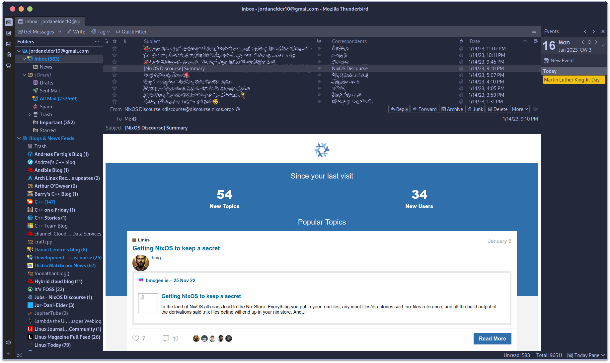
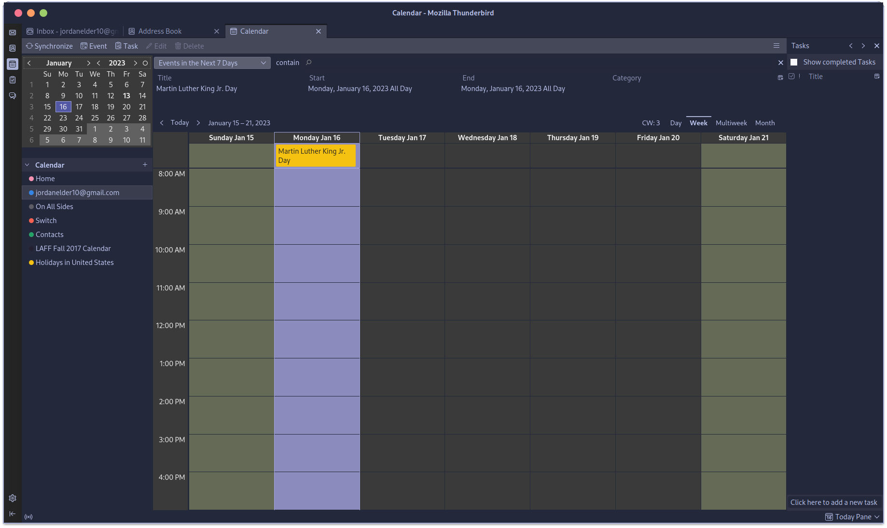
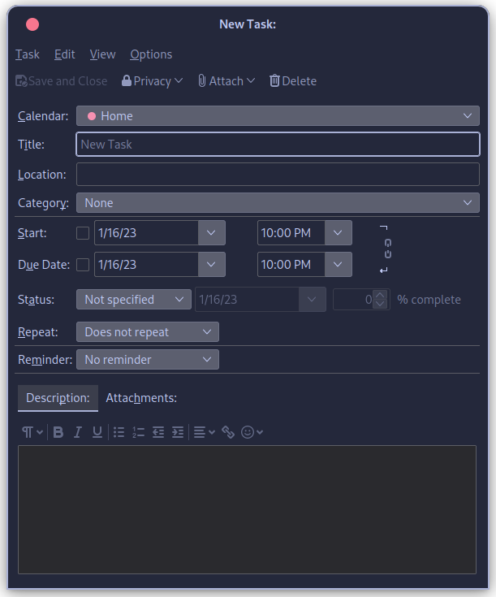
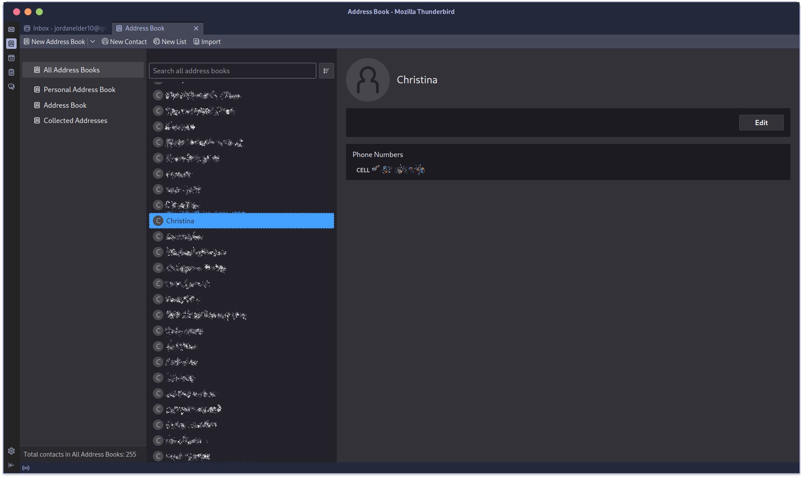
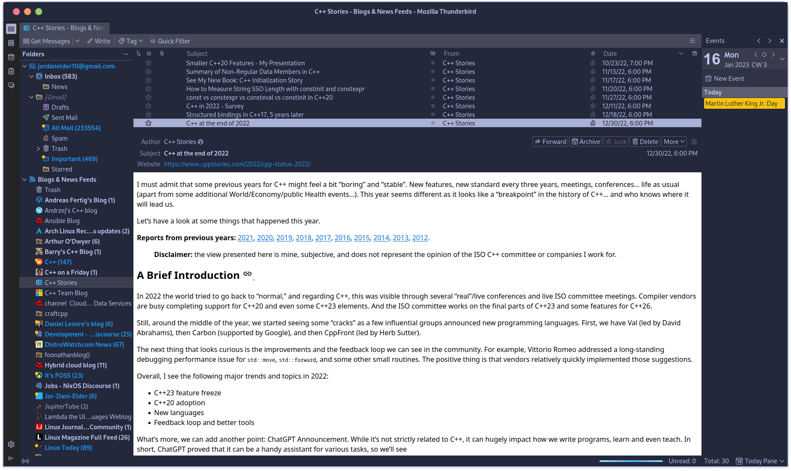
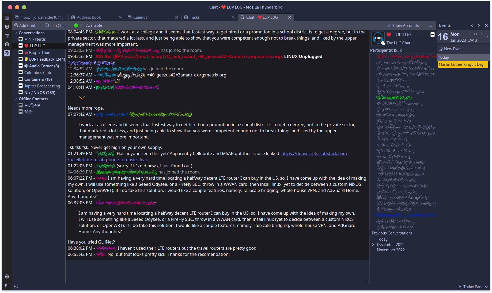

+++
title = "Thunderbird in 2023"
date = "2023-01-16T21:34:04-06:00"
author = ""
authorTwitter = "" #do not include @
cover = "images/Thunderbird.png"
tags = ["thunderbird", "mail", "matrix"]
keywords = ["thunderbird", "mail", "matrix"]
description = "Unleashing the Full Potential of Thunderbird: An In-Depth Look at its Features and Capabilities"
showFullContent = false
readingTime = true
hideComments = false
color = "" #color from the theme settings
+++

# More Than A Mail Client

[Thunderbird](https://www.thunderbird.net/) is a powerful, free and open-source email, news, and chat client developed by the [Mozilla Foundation](https://foundation.mozilla.org/). It is available for Windows, Mac, and Linux operating systems and offers a wide range of features and functionalities to help users access their emails, schedule appointments and events, and customize the look and feel of the application.

One of the key features of Thunderbird is its interoperability with a wide range of email service providers. The application supports popular email protocols which allows it to work seamlessly with most email services, including **Gmail**, **Yahoo**, and **Outlook**, among others. Thunderbird also allows you to set up multiple email accounts *within* the same application, giving you access to all of your email accounts from one central location. Contrary to popular belief, *mail* isn't all it's capable of...

# The Calendar and Reminders

 Additionally, you can use the built-in calendar and task manager to schedule appointments and events, set reminders, and manage your to-do list across your accounts. Thunderbird's Calendar is compatible with other calendar services, such as **Google Calendar**, **Exchange**, and **iCloud**, allowing you to synchronize your events and tasks across multiple devices, this is especially useful if you use multiple devices for work or personal use.

You can quickly check all of your calendars to see what you have planned for the day, week, or month, and make adjustments as needed and allows you to manage your tasks and to-do list. The task manager is quite rich in Thunderbird. Have a look here!

Thunderbird's built-in task manager allows users to efficiently manage their tasks and to-do list, by setting due dates, priorities and marking them as complete, making it a useful tool for staying organized and on top of their schedule.

The built-in contact system allows you to store and organize information about your contacts, such as their name, email address, phone number, and other details; and allows you to create multiple address books, which can be used to organize your contacts into different groups or categories. For example, you can create separate address books for personal contacts, business contacts, or contacts from a specific project or organization.

Thunderbird includes support for newsgroups and RSS feeds, and now also includes Matrix chat support through an extension, allowing you to read and post to newsgroups, subscribe to RSS feeds, and join and chat on Matrix servers, all within the same application. *Newsgroups* in Thunderbird refers to online discussion forums organized by topic. They are similar to forums or message boards, where users can post messages, read messages posted by others, and respond to them.

There's an extension for Matrix Chat, which allows you to join and chat on Matrix servers from within Thunderbird. [Matrix](https://matrix.org/) is a secure, decentralized communication platform that enables real-time communication, including instant messaging, voice, and video calls, and allows for integration with other platforms and services. By using the Matrix Chat extension with Thunderbird, you can join any Matrix room, chat with your contacts, access to your room's history, and more.

All this combined means that you can use Thunderbird as a central hub for all your communication needs, including email, newsgroups, RSS feeds, and Matrix chat, all within the same application; and can be very useful for people who need to keep in touch with multiple groups of people or who need to stay informed on different topics.
