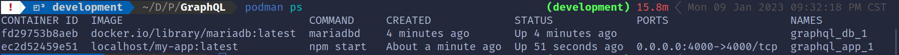
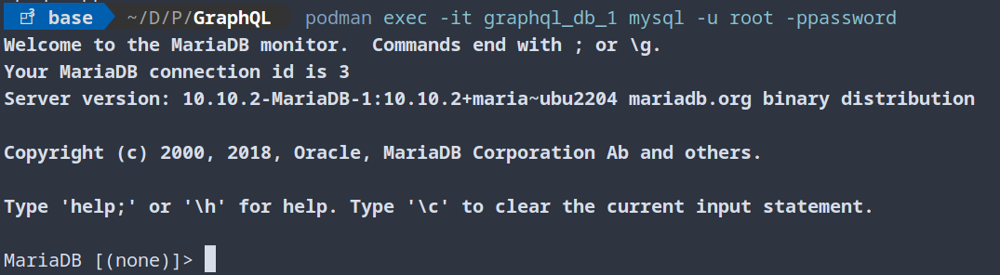
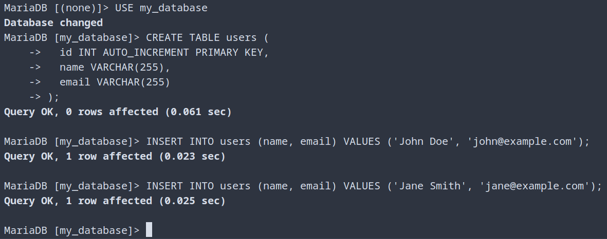
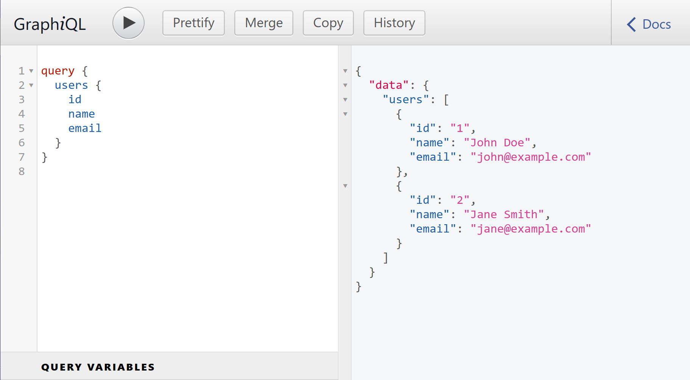

+++
title = "Using GraphQL and Express.js to Query Users from MySQL Database"
date = "2023-01-09T20:54:30-06:00"
author = ""
authorTwitter = "" #do not include @
cover = "images/GraphQL-Post-Thumb.png"
tags = ["podman", "graphql", "express", "node.js", "npm", "mysql", "mariadb", "docker", "docker-compose"]
keywords = ["podman", "graphql", "express.js", "node", "npm", "mysql", "mariadb", "docker", "schema", "database", "query", "mutation", "root resolver"]
description = "Setting up a GraphQL API using Express.js, and connecting it to a MariaDB database using Podman and Docker Compose, allowing us to query and retrieve data from the database using GraphQL."
showFullContent = false
readingTime = true
hideComments = false
color = "" #color from the theme settings
+++

# Starting with the *Why?*

We'll get into what exactly these technologies are, but first I want to explain the reasoning behind my steps in this demonstration. I'm setting out to build a rich GraphQL API and I've never done that before. I've watched some videos, read some docs, and I worked through the following steps. Before it's lost to sleep I'm writing it all down to come back to! I hope this piques your interest!

# So then let's start by defining what each of the technologies are that we'll be using?

>**[GraphQL](https://graphql.org/)** is "a query language for your API" which is a way to ask for specific information from a server. You can use it to get just the data that you need. Think of GraphQL like like asking a librarian for a specific book, it provides a common interface between the client and the server for data fetching and manipulations. In this demo we use it to get two users named John and Jane.

>**[Node.js](https://nodejs.org/en/)** is a programming language that lets you run JavaScript on your computer instead of just in a web browser.

>**[NPM](https://www.npmjs.com/)** stands for "Node Package Manager". It's a Package Manager for Javascript that helps developers share and reuse code. It also helps easily install, update, and use these packages. It is used in conjunction with Node.js, which is a runtime environment that allows developers to run JavaScript on the server-side (as opposed to the client-side, which is what happens in a web browser).

>**[Express.js](https://expressjs.com/)** is a popular web framework for building web applications in Node.js. It provides a set of features and functionality to make it easier to build and deploy web applications using Node.js. It allows developers to set up routes, handle HTTP requests and responses, and connect to databases, among other things. It is often used in conjunction with other tools and libraries, such as GraphQL, to build powerful and scalable web applications.

>**[Graph*i*QL](https://www.gatsbyjs.com/docs/how-to/querying-data/running-queries-with-graphiql/)** is an in-browser tool for testing and developing GraphQL APIs. It allows developers to send GraphQL queries and mutations to the server and see the results in real-time, as well as see documentation for available fields and their arguments. This makes it a useful tool for exploring and debugging GraphQL APIs.

>**[MariaDB](https://mariadb.org/)** and **[MySQL](https://www.mysql.com/)** are popular open-source database management systems. They allow you to store, organize, and retrieve data in a structured way. MariaDB is a fork of MySQL and is compatible with it, meaning that it can use the same data and run the same applications as MySQL. Both MariaDB and MySQL use the SQL language to interact with the database, which is a standard language for accessing and manipulating databases. They are often used in web development to store and retrieve data for web applications.

>**[Docker](https://www.docker.com/)** is a tool designed to make it easier to create, deploy, and run applications by using containers. Containers allow a developer to package up an application with all of the parts it needs, such as libraries and other dependencies, and ship it all out as one package. By doing so, Docker aims to eliminate the "works on my machine" problem.

>**[Podman](https://podman.io/)** is a tool used to run and manage containers, which should work in every way that Docker does to my knowlege. It allows developers to easily package and deploy applications in lightweight containers, making it easier to manage and deploy applications in different environments. Podman is a standalone tool, meaning it does not require a daemon to run, making it more secure and efficient than Docker.

# Now let's just dive in, shall we?

first things first is adding installing the NPM dependencies:  
`npm install --save express express-graphql graphql mysql --force`  

>The `--save` flag tells npm to save these packages as dependencies in your project's `package.json` file. This is useful because it allows other people to easily install all of the required dependencies for your project by running npm install, and in this case it is what we are using to install the proper packages to the container image.

>The `--force` flag tells npm to install the packages even if there are conflicts with already-installed packages. This can be useful if you want to overwrite an existing installation of a package. I had package conflicts and this is the dirty way to deal with them.

---------------------------------------------------------------------------
Now the real first step is planning... Let's stop and think. We are going to set up a GraphQL server using Express.js and connect it to a MariaDB database using the mysql library. There's a few things to note about that setup going in: First we're using podman to create two containers, one for our GraphiQL app and the other for the MariaDB database; and next the containers will be deployed with `podman-compose`. There is one caveat that will be brushed over later. I'm manually inserting information into the MariaDB database for this post. It is possible to go on and add something like [PHPMyAdmin](https://www.phpmyadmin.net/) to manage the database operations.

Copy the following `Dockerfile` to build out the image that will then be linked in the `docker-compose` step.

>`Dockerfile`
```dockerfile
FROM node:12-slim

# Install MariaDB client
RUN apt-get update && apt-get install -y mariadb-client

# Create app directory
WORKDIR /usr/src/app

# Install app dependencies
COPY package*.json ./
RUN npm install

# Copy app source code
COPY . .

# Expose port 4000
EXPOSE 4000

# Run the app
CMD ["npm", "start"]
```

and run it with the following podman or docker command:  
`podman build -t my-app -f Dockerfile`

# Now that we've successfully built the image let's talk about what just happened.

This Dockerfile is used to create a Docker image for a Node.js application that uses MariaDB as a database.

The first line `FROM` specifies the base image, which is a slim version of Node.js v12.

The next line `RUN` installs `mariadb-client` from `apt-get`, which is a command-line tool used to connect to and interact with MariaDB servers. You probably can just shorten that to `apt` but I didn't for some reason.

The `WORKDIR` directive sets the [working directory](https://en.wikipedia.org/wiki/Working_directory) for the subsequent instructions in our `Dockerfile`.

The `COPY` instructions copy the `package.json` and `package-lock.json` files from the current directory to the *working directory* in our image. The `RUN` instruction then installs the dependencies specified in these files using NPM.

The second `COPY` instruction copies all files from the [current directory](https://stackoverflow.com/a/66860904) to the working directory in our image.

The `EXPOSE` directive specifies that the application listens on port `4000`.

Finally, the `CMD` instruction specifies the command to run when the image is run as a container. In this case, it runs `npm start`, which starts our Node.js application.

# Next it's time to set up the GraphQL schema and server files!

We're going to need just two Javascript files for this project: a `server.js` and a `schema.js`

`server.js`

```javascript
const express =         require('express');
const { graphqlHTTP } = require('express-graphql');
const mysql =           require('mysql');
const schema =          require('./schema.js');

const pool = mysql.createPool({
    host: process.env.DATABASE_HOST,
    user: process.env.DATABASE_USER,
    password: process.env.DATABASE_PASSWORD,
    database: process.env.DATABASE_NAME,
});

const root = {
    users: () => {
        return new Promise((resolve, reject) => {
            pool.query('SELECT * FROM users', (error, results) => {
                if (error) {
                    reject(error);
                }
                resolve(results);
            });
        });
    },
};

const app = express();

app.use('/graphql', graphqlHTTP({
    schema,
    rootValue: root,
    graphiql: true,
}));

app.listen(4000, () => {
    console.log('Listening for GraphQL requests on http://localhost:4000/graphql');
});
```

and

`schema.js`  
```javascript
const { buildSchema } = require('graphql');

const schema = buildSchema(`
  type User {
    id: ID!
    name: String!
    email: String!
  }

  type Query {
    users: [User]
  }
  
`);

module.exports = schema;
```

For `server.js` we pulled in the required modules for our app, `express`, `express-graphql`, `mysql`, and our `./schema.js` file, and go on to create the pool to pass [Environment Variables](https://en.wikipedia.org/wiki/Environment_variable) into the container image The root object contains the resolver functions for the GraphQL API. In this case, there is only one resolver function: `users`. The `users` resolver function accepts an args object as an argument, which contains the arguments passed to the user field in the `GraphQL` query. In this case, the args object contains an `id` field, which is used to specify the user to retrieve from our database. Then we set `app = express()` to initialize our express app, and set our endpoint to `/graphql` and to listen on port `4000`. One thing to note is that setting `graphiql: true` ensures that we can run GraphiQL in the the web browser.

For `schema.js` it pulls in the required `graphql` module and sets the schema for which GraphQL will be able to query. For our example we have will provide a database that holds a `users` table with an auto-incrementing `id` field along with `name`, and `email` varchar fields, which looks like this:
```
+----+------------+------------------+
| id | name       | email            |
+----+------------+------------------+
|  1 | John Doe   | john@example.com |
|  2 | Jane Smith | jane@example.com |
+----+------------+------------------+
```  

Which we haven't set-up just yet, but we'll have it up very soon!

# Next up is the MariaDB connection
and to do that we'll set up the final file in our project, the `docker-compose.yml` file, and here it is:  
```yaml
version: '3'
services:
  db:
    image: mariadb
    environment:
      MYSQL_ROOT_PASSWORD: password
      MYSQL_DATABASE: my_database
  app:
    image: my-app:latest
    depends_on:
      - db
    environment:
      DATABASE_HOST: db
      DATABASE_USER: root
      DATABASE_PASSWORD: password
      DATABASE_NAME: my_database
    ports:
      - 4000:4000
```

This `docker-compose.yml` file specifically sets up two services, our `db` and our `app`. `db` pulls down the `mariadb` image from [DockerHub](https://hub.docker.com/_/mariadb) and sets that containers Environment Variables for the Database Password and Database. This is just a demo so I'm fine with this password setup. Continuing, `app` will try to pull an image named `my-app` if you skipped running the build command prior to this step, again that command is `podman build -t my-app -f Dockerfile` (and yes I'm tacking the `-f` on to be explicit, everyone shows the `-d` command). The `depends_on` line is the reason we're using the compose method, it makes it easy to link the containers together. Finally we add four environment variables to app, and set the port on the `host:image` to `4000:4000`.

# You're FINALLY ready to run...
`podman-compose up -d`  
Success!

Now that both of our containers are up and running we can run a:  
`podman ps` to prove it, or if you didn't have a successful run you may want to check out:  
`podman ps -a` to see if anything has errored. If you have to modify any of the files you can issue a removal of the image with:
`podman rm -f <hash-of-the-image>`  
and rebuild the app image using the `Dockerfile` with:  
`podman build -t my-app -f Dockerfile`  
and re-running:  
`podman-compose up -d`



# But we're not done yet!

Now that our containers are up we can check `localhost:4000/graphql` in a web browser to see that ou GraphiQL instance is up and running, but we need to first insert our user information into the database to be retrieved by a GraphQL query. To do that I opted for a raw MySQL method. To follow me through these steps first run:  

`podman ps`  
to find your containers name, for me it's the column at the furthest right, under the header called `NAMES` like in the above image.

using that name run the following command to start a MySQL connection from within the container:

`podman exec -it graphql_db_1 mysql -u root -ppassword`



Note that using `podman run` runs a new container whereas `podman exec` launches the currently running image!

Now that we're successfully on the [MySQL CLI](https://dev.mysql.com/doc/refman/8.0/en/mysql.html) let's throw our user data in by issuing the following commands:  
```sql
USE my_database;
```
Create the `users` table
```sql
CREATE TABLE users (
  id INT AUTO_INCREMENT PRIMARY KEY,
  name VARCHAR(255),
  email VARCHAR(255)
);
```
and insert our users into the table
```sql
INSERT INTO users (name, email) VALUES ('John Doe', 'john@example.com');
INSERT INTO users (name, email) VALUES ('Jane Smith', 'jane@example.com');
```
before we go we can quickly check that we are successfully able to query our table information:
```sql
SELECT * FROM users;
```
at which point you should see the following output:
```
+----+------------+------------------+
| id | name       | email            |
+----+------------+------------------+
|  1 | John Doe   | john@example.com |
|  2 | Jane Smith | jane@example.com |
+----+------------+------------------+
```



# The Final Stretch!

Now that all of the pieces are in place, and the database is fueled up, let's run a GraphQL Query!!!  

Oh this part is so exciting. I worked for a long time getting it right, but now we should be able to go to `localhost:4000/graphql` in our browser and punch in the following query:
```json
query {
  users {
    id
    name
    email
  }
}
```
and if everything goes right for you, you'll see..!
```json
{
  "data": {
    "users": [
      {
        "id": "1",
        "name": "John Doe",
        "email": "john@example.com"
      },
      {
        "id": "2",
        "name": "Jane Smith",
        "email": "jane@example.com"
      }
    ]
  }
}
```



This project was quite the journey! Firstly used `NPM`, the default package manager for `Node.js`, to install the required dependencies for our `app` This included the `mysql` library, which we used to connect to the MariaDB database, and the `express-graphql` library, which allows us to use `GraphQL` with `Express.js`. We really started things off by setting up a `Dockerfile` to initialize the `Node.js` container named `my-app`. Then we created two files `server.js`, and `schema.js` to run our `Express server` which hosts the `GraphQL API` that we defined that GraphQL `schema.js` file and finally built and linked in the `MariaDB` database through a `docker-compose.yml` configuration. Fueled up our `MariaDB` with some mock-up `users`, John and Jane, and used a `GraphQL query` to pull their info from the database!

Overall, working with `Podman` and setting up a `docker-compose` file was a great way to manage the different components of our project and make sure everything was running correctly. And using `NPM` to install the necessary packages for our server made it easy to get everything set up and running. It was definitely a learning experience, but in the end, we were able to get everything working and have a fully functional `GraphQL API`!