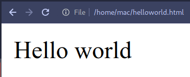

+++
title = "How To Start Website Development"
date = "2023-09-18T15:11:46-05:00"
author = "Jordan"
authorTwitter = "" #do not include @
cover = "images/cover.png"
tags = ["web", "development", "tutorial"]
keywords = ["web", "development", "tutorial"]
description = ""
showFullContent = false
readingTime = true
hideComments = false
color = "" #color from the theme settings
+++

The first time you look at computer code you might stare until you go cross-eyed, but with a little guidance that same mangled text can quickly become a sharp tool for creativity. This introductory guide is something I wish I had when starting out. I hope it can help those with zero experience get started or at least walk away with an understanding of a few concepts found in website development.

### Object
an [object](https://www.w3schools.com/js/js_objects.asp) in programming is a collection of data

```js
const message = {
    "sentence": "Hello world!"
}
```

* **const** - stands for `constant variable` a variable can typically change its value, but a constant variable will not change. 

<hr/>  

### HTML
[HTML](https://www.w3.org/wiki/Html/Training/What_is_HTML) stands for *Hypertext Markup Language* which is in a class of languages called [Markup Languages](https://en.wikipedia.org/wiki/Markup_language) and it tells Web Browsers what to do with your important website information.

```html
<div id="webpage">Hello world</div>
```  

* **div** - stands for `division`, but not like in math, a `div` tag seperates elements in a page.  
* This div has an `id` attribute we assign the name of "webpage" for use in our upcoming script.  
* `</div>` - every *tag* in HTML has a `closing tag` represented with the name of the Element with a `/` in front, in our case `</div>`.  

### Javascript
[Javascript](https://en.wikipedia.org/wiki/JavaScript) is what's called a [scripting language](https://en.wikipedia.org/wiki/Scripting_language)  
> This example is actually a [subset](https://en.wikipedia.org/wiki/Subset) of Javascript, called a [framework](https://en.wikipedia.org/wiki/Comparison_of_JavaScript-based_web_frameworks), named [jQuery](https://en.wikipedia.org/wiki/JQuery). I find it both more efficient and easier to learn Javascript through playing with jQuery, but there are reasons, you'll discover on your own, for pure Javascript and [supersets](https://en.wikipedia.org/wiki/Subset) of Javascript like [Typescript](https://en.wikipedia.org/wiki/TypeScript)

```javascript
$("#webpage").text(message.sentence);
```  

* The `$()` is a `jQuery selector` it's a shorthand *selector* for **HTML DOM Elements**, **Classes**, and in our case **IDs**, denoted by the preceeding `#` and our `<div>`'s given name `webpage`.  
* The `.` following the `$()` is a *[chain operator](https://www.w3schools.com/jquery/jquery_chaining.asp)*, which *promises* to execute each following *function* attached, in our case it's `text()` with our **Object** called.  
* The **Object** is in a format called *Javascript Object Notation* typically shortened to *[JSON](https://en.wikipedia.org/wiki/JSON)* which also uses a `.` operator to denote the hierarchical structure we defined before: our `message` variable contains the `sentence` key which returns the `Hello world!` value. This is the essence of [data structures](https://en.wikipedia.org/wiki/Data_structure) in a format called [Key-Value Store](https://en.wikipedia.org/wiki/Key%E2%80%93value_database) which will be your bread and butter for all things data going forward.

<hr/>  

`<filename>.html from a web browser`  


<hr/>

`Putting It All Together!`

```html
<!DOCTYPE html>
<html lang="en">
<head>
    <meta charset="UTF-8">
    <meta name="viewport" content="width=device-width, initial-scale=1.0">
    <title>Key-Value Store Example</title>
    <script src="https://code.jquery.com/jquery-3.7.1.min.js" integrity="sha256-/JqT3SQfawRcv/BIHPThkBvs0OEvtFFmqPF/lYI/Cxo=" crossorigin="anonymous"></script>
</head>
<body style="background:pink">
    <!-- HTML -->
    <div id="webpage">Hello world</div>
    <script>

        // Object
        const message = {
            "sentence": "Hello world!"
        };

        // Javascript
        $("#webpage").text(message.sentence);

    </script>
</body>
</html>
```
* WOW THAT'S A LOT MORE STUFF!
* Now that you understand the basics and the few things that really mattered in this web page, there's nothing left but to see a real world example such as this.
* There's a lot here, but one thing to play with is the `style` attribute on the `<body>` tag, start by changing that value and have fun learning!
* you can copy/paste this code into a file called `hello.html` and open it in your web browser to view. To edit again right click and select `open with` and choose a text editor. I recommend downloading [Microsoft VS Code](https://code.visualstudio.com/download) if you don't have anything but notepad.
* I also recommend typing all of this block out by hand so you can get a feel for it, but also understand that there is tooling out there such as [Emmet](https://code.visualstudio.com/docs/editor/emmet) that are meant to generate stuff for you later on in your journey~
* From here check out the [LAMP Stack](https://blog.apilayer.com/lamp-stack-what-is-it-advantages-alternatives-in-2023/)
* and be sure you have visited [W3C Schools](https://www.w3schools.com/)
* Happy Hacking!